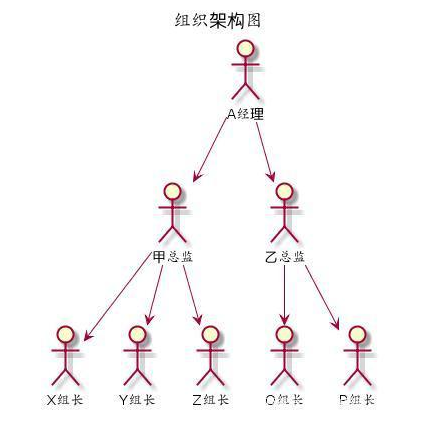

## 动态规划

（Dynamic programming，简称DP）

> 动态规划算法是通过拆分问题，定义问题状态和状态之间的关系，使得问题能够以递推（或者说分治）的方式去解决。
> 动态规划算法的基本思想与分治法类似，也是将待求解的问题分解为若干个子问题（阶段），按顺序求解子阶段，前一子问题的解，为后一子问题的求解提供了有用的信息。在求解任一子问题时，列出各种可能的局部解，通过决策保留那些有可能达到最优的局部解，丢弃其他局部解。依次解决各子问题，最后一个子问题就是初始问题的解。

### 基本思想和策略编辑

动态规划主要包含两个问题：

- 递归：递归求解子问题

- 备忘录：将一计算的值存储在表中

  动态规划=递归+备忘录

由于动态规划解决的问题多数有重叠子问题这个特点，为减少重复计算，对每一个子问题只解一次，将其不同阶段的不同状态保存在一个二维数组中。

首先是拆分问题，根据问题的可能性把问题划分成一步一步这样可以通过递推或递归来实现，关键就是这个步骤,动态规划有一类问题就是从后往前推到,有时候我们很容易知道:**如果只有一种情况时,最佳的选择应该怎么做**.然后根据这个最佳选择往前一步推导,得到前一步的最佳选择。

**然后就是定义问题状态和状态之间的关系**,我的理解是前面拆分的步骤之间的关系,用一种**量化的形式**表现出来,类似于高中学的推导公式,因为这种式子很容易用程序写出来,也可以说对程序比较亲和(也就是最后所说的状态转移方程式)

**我们再来看定义的下面的两段**,我的理解是比如我们找到最优解,我们应该讲最优解保存下来,为了往前推导时能够使用前一步的最优解,在这个过程中难免有一些相比于最优解差的解,此时我们应该放弃,**只保存最优解**,这样我们每一次都把最优解保存了下来,大大降低了时间复杂度

### 判断是否适用

使用动态规划的性质可判断动态规划是否适用于给定的问题

- 最优子结构：问题的最优解是否包含子问题的最优解
- 子结构重叠：递归求解过程中包含少了不同子问题的多次重复计算

### 实现方法

1. 自底向上动态规划法

   该方法从最小的可能输入值开始对函数进行调用，然后逐步增大参数值来计算其返回值。在计算返回值时，将所有已计算的值存储在表中（备忘录）。当对较大的参数进行计算时，就可以利用已经计算的小参数的值。

2. 自顶向下动态规划法

   将问题分解为一系列系问题，对每一个子问题求解，记住问题的解，以备后用，此外，递归函数的最终操作是保存每个已计算的值，而最先的操作是判断是否存在已计算的值。

### 例子



比如：考核的时候，公司要挑选出三个最优秀的员工。一般高级经理会跟手下的经理说，你去把你们那边最优秀的3个人报给我，经理又跟总监说你把你们那边最优秀的人报给我，经理又跟组长说，你把你们组最优秀的三个人报给我，这个其实就动态规划的思想！

首先是重叠解问题，不同的问题，可能都要求1个相同问题的解。假如A经理想知道他下面最优秀的人是谁，他必须知道X,Y,Z,O,P组最优秀的人是谁， 甲总监想知道自己下面最优秀的人是谁，也要去知道X,Y,Z组里面最优秀的人是谁？这就有问题重叠了，两个人都需要了解X,Y,Z三个小组最优秀的人。

其次是最优子结构，最优解肯定是有最优的子解转移推导而来，子解必定也是子问题的最优解。甲总监下面最优秀的3个人肯定是从X,Y,Z提交上来的3份名单中选择最优秀的三个人。例如Q哥是X组长下面的第5名，那么他肯定不可能是甲总监下面最优秀的三个。

第三是无后效性，这个问题可能比较难理解，也就是求出来的子问题并不会因为后面求出来的改变。我们可以理解为，X组长挑选出三个人，即便到了高级经理选出大部门最优秀的三个人，对于X组来说，最优秀的还是这3个人，不会发生改变。

### 解决步骤

1. **划分状态**，即划分子问题，例如上面的例子，我们可以认为每个组下面、每个部门、每个中心下面最优秀的3个人，都是全公司最优秀的3个人的子问题
2. **状态表示**，即如何让计算机理解子问题。上述例子，我们可以实用f[i][3]表示第i个人，他手下最优秀的3个人是谁。
3. **状态转移**，即父问题是如何由子问题推导出来的。上述例子，每个人大Leader下面最优秀的人等于他下面的小Leader中最优秀的人中最优秀的几个。
4. **确定边界**，确定初始状态是什么？最小的子问题？最终状态又是什么。例如上述问题，最小的子问题就是每个小组长下面最优秀的人，最终状态是整个企业，初始状态为每个领导下面都没有最优名单，但是小组长下面拥有每个人的评分。

### 动态规划算法的例子

- 许多字符串算法，如最长公共子序列、最长递增子序列、最长公共子串、编辑距离。
- 关于图的有效求解算法：寻找图中最短距离的Bellman-Ford算法、Floyd的所有定点问题最短路径算法等。
- 链矩阵乘法
- 子集和
- 0/1背包问题
- 旅行商问题

动态规划思想

先了解动态规划的如何工作

1. 斐波那契（Fibonacci）数列

   定义:

   >Fib(n)=0         				 	   n=0
   >
   >​          =1         					    n=1
   >
   >​          =Fib(n-1)+Fib(n-2)    n>1

   递归实现：

   ```java
   int RecursiveFibonacci(int n){
       if(n==0){
           return 0;
       }
       if(n==1){
           return 1;
       }
       return RecursiveFibonacci(n-1)+ RecursiveFibonacci(n-2);
   }
   ```

   **备忘录如何起作用**：当调用fib(5)产生调用树，该树对同一个参数值的函数调用多次：

   >fib(5)
   >
   >fib(4)+fib(3)
   >
   >(fib(3)+fib(2))+(fib(2)+fib(1))
   >
   >((fib(2)+fib(1))+(fib(1)+fib(0)))+((fib(1)+fib(0))+fib(1))
   >
   >((fib(1)+fib(0))+fib(1))+((fib(1)+fib(0))+((fib(1)+fib(0))+fib(1))

   在这里fib(2)被计算了3次（子问题的重叠），如果n比较大，那么将有更多的fib函数的值被重复计算，从而导致算法的复杂度为指数级。可以通过保存先钱计算的值来避免重复求解同一个问题，降低算法的复杂度。

   备忘录的作用：当开始执行一个递归函数时，增加一个函数参数与函数返回值的映射表。因此，如果同一参数的函数被第二次调用，那么可以简单的在表中查询相应的结果。

   **改进**：

   第一种自底向上：从输入的最小参数值开始，逐步构建更大参数值的解。

   ```java
   int fib[n];
   int fib（int n）{
       if(n==0|n==1){
           return 1;
       }
       for(int i=2;i<n;i++){
           fib[i]=fib[i-1]+fib[i-1];
       }
       return fib[n-1];
   }
       
   ```

   第二种方法自顶向下。保留递归，如果子问题的解已计算则使用该值。

   ```java
   int fib[n];
   int fibonacci(int n){
       if(n==1){
           return 1;
       }
       if(n==2){
           return 1;
       }
       if(fib[n]!=0){
           return fib[n];
       }
       return fib[n]=fibonacci(n-1)+fibonacci(n-2);
   }
   ```

   时间复杂度O（n）,空间复杂度O（n）。

   **进一步改进**：

   只存储最后两次计算的值就能计算出当前值。

   ```java
   int fibonacci(int n){
       int a=0,b=1,sum,i;
       for(i=0;i<n;i++){
           sum=a+b;
           a=b;
           b=sum;
       }
       return sum;
   }
   ```

   时间复杂度O（n）,空间复杂度O（1）。

2. 数的阶乘

3. 最长公共子序列

   已知两个字符串，长度为m的字符串M和长度为n的字符串Y，找出最长公共子序列：在两个字符串中从左至右均出现的最长字符序列（不一定连续）。例如X=ABCBDAB Y=BDCABA最长公共子序列LCS(X,Y)={BCBA ,BDAB,BCAB}可能存在多个最优解

   - 蛮力法：检查A的每个子序列是否也是Y的一个子序列，X有2<sup>m</sup>个子序列，对于大序列，这个方法是低效的。

   - 递归求解：

     假设两个首字符不同，那么这两个字符不可能都属于公共子序列，公共子序列可能包含其中一个，或者2个都不包含。

     LCS问题求解过程涉及X和Y中的两个子序列，假设X子序列的开始下标为i,Y子序列的开始下标为j,X[<sub>i...m</sub>]是一个X的从i开始到末尾的子串，Y[<sub>j...n</sub>]是一个Y的从j开始到末尾的子串。

     可能存在如下的情景：

     1）X[i]=Y[j],则1+LCS(i+1,j+1)

     2)X[i]!=Y[j],则LCS(i,j+1)     //跳过Y的第j个字符

     3）X[i]!=Y[j] 则LCS（i+1,j） //跳过X的第i个字符

     对于第一种，如果相等，则找到一个匹配对，并将其计入LCS的总长度中，否则跳过X的第i个或者Y的第j个，然后继续寻找。

     ```java
     int LCSLength(int X[],int i,int m,int T[],int j,int n){
         if(i==m||j==n){
             return 0;
         }else if(X[i]==Y[j]){
             return 1+LCSLength(X,i+1,m,Y,j+1,n);
         }else{
             return max(LCSLength(X,i+1,m,Y,j,n),LCSLength(X,i,m,Y,j+1,n));
         }
     }
     ```

     

   - 动态规划法求解：增加备忘录

     

     

     

     ```java
     
     ```

