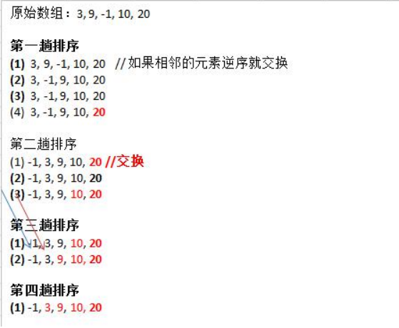

# 排序算法

## 一、概念

排序也称排序算法(Sort Algorithm)，排序是将一组数据，依指定的顺序进行排列的过程。

## 二、分类：

1. 内部排序:

   指将需要处理的所有数据都加载到内部存储器中进行排序。

2. 外部排序法：

   数据量过大，无法全部加载到内 存中，需要借助外部存储进行

3. 常见的排序算法

   

## 三、算法的时间复杂度

一、度量一个程序执行时间的两种方法：

1. 事后统计的方法
    这种方法可行, 但是有两个问题：一是要想对设计的算法的运行性能进行评测，需要实际运行该程序；二是所得时间的统计量依赖于计算机的硬件、软件等环境因素, **这种方式，要在同一台计算机的相同状态下运行，才能比较那个算法**速度更快。
2. 事前估算的方法
    通过分析某个算法的**时间复杂度**来判断哪个算法更优.

二、时间频度

1. 基本介绍

   时间频度：一个算法花费的时间与算法中语句的执行次数成正比例，哪个算法中语句执行次数多，它花费时间就多。一个算法中的语句执行次数称为语句频度或时间频度。记为T(n)。

2. 注意

   忽略常数项

   忽略低次项

   忽略系数

三、时间复杂度

1. 一般情况下，算法中的基本操作语句的重复执行次数是问题规模n的某个函数，用T(n)表示，若有某个辅助函数f(n)，使得当n趋近于无穷大时，T(n) / f(n) 的极限值为不等于零的常数，则称f(n)是T(n)的同数量级函数。记作 T(n)=Ｏ( f(n) )，称Ｏ( f(n) ) 为算法的渐进时间复杂度，简称时间复杂度。

2. T(n) 不同，但时间复杂度可能相同。 如：T(n)=n²+7n+6 与 T(n)=3n²+2n+2 它们的T(n) 不同，但时间复杂度相同，都为O(n²)。

3. 计算时间复杂度的方法：
   - 用常数1代替运行时间中的所有加法常数 T(n)=n²+7n+6  => T(n)=n²+7n+1
   - 修改后的运行次数函数中，只保留最高阶项 T(n)=n²+7n+1 => T(n) = n²
   - 去除最高阶项的系数 T(n) = n² => T(n) = n² => O(n²)

4. 常用时间复杂度

   1)常数阶O(1)

   2)对数阶O(log2n)

   3)线性阶O(n)

   4)线性对数阶O(nlog2n)

   5)平方阶O(n^2)

   6)立方阶O(n^3)

   7)k次方阶O(n^k)

   8)指数阶O(2^n)

   说明：•常见的算法时间复杂度由小到大依次为：Ο(1)＜Ο(log2n)＜Ο(n)＜Ο(nlog2n)＜Ο(n2)＜Ο(n3)＜ Ο(nk)＜Ο(2n) ，随着问题规模n的不断增大，上述时间复杂度不断增大，算法的执行效率越低

   - 常数阶O(1)：

     无论代码执行了多少行，只要是没有循环等复杂结构，那这个代码的时间复杂度就都是O(1）

   - 对数阶O(log2n)

     在while循环里面，每次都将 i 乘以 2，乘完之后，i 距离 n 就越来越近了。假设循环x次之后，i 就大于 2 了，此时这个循环就退出了，也就是说 2 的 x 次方等于 n，那么 x = log2n也就是说当循环 log2n次以后，这个代码就结束了。因此这个代码的时间复杂度为：O(log2n**) 。 O(**log2n) 的这个2 时间上是根据代码变化的，i = i * 3 ，则是 O(log3n) .

   - 线性阶O(n)

     for循环里面的代码会执行n遍，因此它消耗的时间是随着n的变化而变化的，因此这类代码都可以用O(n)来表示它的时间复杂度

   - 线性对数阶O(nlogN)

     线性对数阶O(nlogN) 其实非常容易理解，将时间复杂度为O(logn)的代码循环N遍的话，那么它的时间复杂度就是 n * O(logN)，也就是了O(nlogN)

   - 平方阶O(n²)

     平方阶O(n²) 就更容易理解了，如果把 O(n) 的代码再嵌套循环一遍，它的时间复杂度就是 O(n²)，这段代码其实就是嵌套了2层n循环，它的时间复杂度就是 O(n*n)，即 O(n²) 如果将其中一层循环的n改成m，那它的时间复杂度就变成了 O(m*n)

   - 立方阶O(n³)**、**K次方阶O(n^k)'

  5. 平均时间复杂度和最坏时间复杂度

     - 平均时间复杂度是指所有可能的输入实例均以等概率出现的情况下，该算法的运行时间。

     - 最坏情况下的时间复杂度称最坏时间复杂度。一般讨论的时间复杂度均是最坏情况下的时间复杂度。 这样做的原因是：最坏情况下的时间复杂度是算法在任何输入实例上运行时间的界限，这就保证了算法的运行时间不会比最坏情况更长。

     - 平均时间复杂度和最坏时间复杂度是否一致，和算法有关(如图:)。

     


  6. 算法的空间复杂度简介

     - 类似于时间复杂度的讨论，一个算法的空间复杂度(Space Complexity)定义为该算法所耗费的存储空间，它也是问题规模n的函数。
     - 空间复杂度(Space Complexity)是对一个算法在运行过程中临时占用存储空间大小的量度。有的算法需要占用的临时工作单元数与解决问题的规模n有关，它随着n的增大而增大，当n较大时，将占用较多的存储单元，例如快速排序和归并排序算法就属于这种情况
     - 在做算法分析时，**主要讨论的是时间复杂度**。从用户使用体验上看，更看重的程序执行的速度。一些缓存产品(redis, memcache)和算法(基数排序)本质就是用空间换时间.

     

## 四、常用算法

1. 冒泡排序

   - 概念：冒泡排序（Bubble Sorting）的基本思想是：通过对待排序序列从前向后（从下标较小的元素开始）,依次比较相邻元素的值，若发现逆序则交换，使值较大的元素逐渐从前移向后部，就象水底下的气泡一样逐渐向上冒。

   ​     因为排序的过程中，各元素不断接近自己的位置，如果一趟比较下来没有进行过交换，就说明序列有序，因此要在排序过程中设置一个标志flag判断元素是否进行过交换。从而减少不必要的比较。(这里说的优化，可以在冒泡排序写好后，在进行)

   - 示例：

     

   - 总结：

     - 一共进行数组的大小-1次大的循环
     - 每一趟排序的次数在逐渐的减少
     - 如果某一次排序中没有发生一次交换，可以提前结束

   - 代码实现

     ```java
     package com.zixin.learn.sgg.datastructure.sort;
     
     import java.text.SimpleDateFormat;
     import java.util.Arrays;
     import java.util.Date;
     
     /**
      * 
      * @ClassName: BubbleSort
      * @Description: 冒泡排序
      * @author Administrator
      * @date 2020-03-08 16:25:28
      */
     public class BubbleSort {
     
     	public static void main(String[] args) {
     		// int arr[] = {3, 9, -1, 10, 20};
     		//
     		// System.out.println("排序前");
     		// System.out.println(Arrays.toString(arr));
     
     		// 为了容量理解，我们把冒泡排序的演变过程，给大家展示
     
     		// 测试一下冒泡排序的速度O(n^2), 给80000个数据，测试
     		// 创建要给80000个的随机的数组
     		int[] arr = new int[80000];
     		for (int i = 0; i < 80000; i++) {
     			arr[i] = (int) (Math.random() * 8000000); // 生成一个[0, 8000000) 数
     		}
     
     		Date data1 = new Date();
     		SimpleDateFormat simpleDateFormat = new SimpleDateFormat("yyyy-MM-dd HH:mm:ss");
     		String date1Str = simpleDateFormat.format(data1);
     		System.out.println("排序前的时间是=" + date1Str);
     
     		// 测试冒泡排序
     		bubbleSort(arr);
     
     		Date data2 = new Date();
     		String date2Str = simpleDateFormat.format(data2);
     		System.out.println("排序后的时间是=" + date2Str);
     
     		// System.out.println("排序后");
     		// System.out.println(Arrays.toString(arr));
     
     		/*
     		 * 
     		 * // 第二趟排序，就是将第二大的数排在倒数第二位
     		 * 
     		 * for (int j = 0; j < arr.length - 1 - 1 ; j++) { // 如果前面的数比后面的数大，则交换 if
     		 * (arr[j] > arr[j + 1]) { temp = arr[j]; arr[j] = arr[j + 1]; arr[j + 1] =
     		 * temp; } }
     		 * 
     		 * System.out.println("第二趟排序后的数组"); System.out.println(Arrays.toString(arr));
     		 * 
     		 * 
     		 * // 第三趟排序，就是将第三大的数排在倒数第三位
     		 * 
     		 * for (int j = 0; j < arr.length - 1 - 2; j++) { // 如果前面的数比后面的数大，则交换 if (arr[j]
     		 * > arr[j + 1]) { temp = arr[j]; arr[j] = arr[j + 1]; arr[j + 1] = temp; } }
     		 * 
     		 * System.out.println("第三趟排序后的数组"); System.out.println(Arrays.toString(arr));
     		 * 
     		 * // 第四趟排序，就是将第4大的数排在倒数第4位
     		 * 
     		 * for (int j = 0; j < arr.length - 1 - 3; j++) { // 如果前面的数比后面的数大，则交换 if (arr[j]
     		 * > arr[j + 1]) { temp = arr[j]; arr[j] = arr[j + 1]; arr[j + 1] = temp; } }
     		 * 
     		 * System.out.println("第四趟排序后的数组"); System.out.println(Arrays.toString(arr));
     		 */
     
     	}
     
     	// 将前面额冒泡排序算法，封装成一个方法
     	public static void bubbleSort(int[] arr) {
     		// 冒泡排序 的时间复杂度 O(n^2), 自己写出
     		int temp = 0; // 临时变量
     		boolean flag = false; // 标识变量，表示是否进行过交换
     		for (int i = 0; i < arr.length - 1; i++) {
     
     			for (int j = 0; j < arr.length - 1 - i; j++) {
     				// 如果前面的数比后面的数大，则交换
     				if (arr[j] > arr[j + 1]) {
     					flag = true;
     					temp = arr[j];
     					arr[j] = arr[j + 1];
     					arr[j + 1] = temp;
     				}
     			}
     			// System.out.println("第" + (i + 1) + "趟排序后的数组");
     			// System.out.println(Arrays.toString(arr));
     
     			if (!flag) { // 在一趟排序中，一次交换都没有发生过
     				break;
     			} else {
     				flag = false; // 重置flag!!!, 进行下次判断
     			}
     		}
     	}
     
     }
     
     ```

     

     

2. 选择排序

   - 概念：选择式排序也属于内部排序法，是从欲排序的数据中，按指定的规则选出某一元素，再依规定交换位置后达到排序的目的。

   - 思路：选择排序（select sorting）也是一种简单的排序方法。它的**基本思想**是：第一次从arr[0]~arr[n-1]中选取最小值，与arr[0]交换，第二次从arr[1]~arr[n-1]中选取最小值，与arr[1]交换，第三次从arr[2]~arr[n-1]中选取最小值，与arr[2]交换，…，第i次从arr[i-1]~arr[n-1]中选取最小值，与arr[i-1]交换，…, 第n-1次从arr[n-2]~arr[n-1]中选取最小值，与arr[n-2]交换，总共通过n-1次，得到一个按排序码从小到大排列的有序序列。

   - 图解

     

   - 总结

     - 选择排序一共有数组大小-1轮排序

     - 每一轮排序，又是一个循环，

       假定当前这个数是最小数

       然后和后面的每一个进行比较，如果有更小的数，就重新确定最小数，并得到下标

       当遍历到最后时，就得到本轮最小数和下标

   - 代码实现

     ```java
     package com.zixin.learn.sgg.datastructure.sort;
     
     import java.text.SimpleDateFormat;
     import java.util.Arrays;
     import java.util.Date;
     /**
      * 
      * @ClassName: SelectSort
      * @Description: 选择排序
      * @author Administrator
      * @date 2020-03-08 16:46:31
      */
     public class SelectSort {
     
     	public static void main(String[] args) {
     		//int [] arr = {101, 34, 119, 1, -1, 90, 123};
     		
     		//创建要给80000个的随机的数组
     		int[] arr = new int[80000];
     		for (int i = 0; i < 80000; i++) {
     			arr[i] = (int) (Math.random() * 8000000); // 生成一个[0, 8000000) 数
     		}
     		
     		System.out.println("排序前");
     		//System.out.println(Arrays.toString(arr));
     		
     		Date data1 = new Date();
     		SimpleDateFormat simpleDateFormat = new SimpleDateFormat("yyyy-MM-dd HH:mm:ss");
     		String date1Str = simpleDateFormat.format(data1);
     		System.out.println("排序前的时间是=" + date1Str);
     		
     		selectSort(arr);
     		
     		
     		Date data2 = new Date();
     		String date2Str = simpleDateFormat.format(data2);
     		System.out.println("排序前的时间是=" + date2Str);
     		
     		//System.out.println("排序后");
     		//System.out.println(Arrays.toString(arr));
     		
     		
     	}
     	
     	//选择排序
     	public static void selectSort(int[] arr) {
     		
     		
     		
     		//在推导的过程，我们发现了规律，因此，可以使用for来解决
     		//选择排序时间复杂度是 O(n^2)
     		for (int i = 0; i < arr.length - 1; i++) {
     			int minIndex = i;
     			int min = arr[i];
     			for (int j = i + 1; j < arr.length; j++) {
     				if (min > arr[j]) { // 说明假定的最小值，并不是最小
     					min = arr[j]; // 重置min
     					minIndex = j; // 重置minIndex
     				}
     			}
     
     			// 将最小值，放在arr[0], 即交换
     			if (minIndex != i) {
     				arr[minIndex] = arr[i];
     				arr[i] = min;
     			}
     
     			//System.out.println("第"+(i+1)+"轮后~~");
     			//System.out.println(Arrays.toString(arr));// 1, 34, 119, 101
     		}
     		
     		
     		/*
     		
     		//使用逐步推导的方式来，讲解选择排序
     		//第1轮
     		//原始的数组 ： 	101, 34, 119, 1
     		//第一轮排序 :   	1, 34, 119, 101
     		//算法 先简单--》 做复杂， 就是可以把一个复杂的算法，拆分成简单的问题-》逐步解决
     		
     		//第1轮
     		int minIndex = 0;
     		int min = arr[0];
     		for(int j = 0 + 1; j < arr.length; j++) {
     			if (min > arr[j]) { //说明假定的最小值，并不是最小
     				min = arr[j]; //重置min
     				minIndex = j; //重置minIndex
     			}
     		}
     		
     		
     		//将最小值，放在arr[0], 即交换
     		if(minIndex != 0) {
     			arr[minIndex] = arr[0];
     			arr[0] = min;
     		}
     		
     		System.out.println("第1轮后~~");
     		System.out.println(Arrays.toString(arr));// 1, 34, 119, 101
     		
     		
     		//第2轮
     		minIndex = 1;
     		min = arr[1];
     		for (int j = 1 + 1; j < arr.length; j++) {
     			if (min > arr[j]) { // 说明假定的最小值，并不是最小
     				min = arr[j]; // 重置min
     				minIndex = j; // 重置minIndex
     			}
     		}
     
     		// 将最小值，放在arr[0], 即交换
     		if(minIndex != 1) {
     			arr[minIndex] = arr[1];
     			arr[1] = min;
     		}
     
     		System.out.println("第2轮后~~");
     		System.out.println(Arrays.toString(arr));// 1, 34, 119, 101
     		
     		//第3轮
     		minIndex = 2;
     		min = arr[2];
     		for (int j = 2 + 1; j < arr.length; j++) {
     			if (min > arr[j]) { // 说明假定的最小值，并不是最小
     				min = arr[j]; // 重置min
     				minIndex = j; // 重置minIndex
     			}
     		}
     
     		// 将最小值，放在arr[0], 即交换
     		if (minIndex != 2) {
     			arr[minIndex] = arr[2];
     			arr[2] = min;
     		}
     
     		System.out.println("第3轮后~~");
     		System.out.println(Arrays.toString(arr));// 1, 34, 101, 119 */
     
     		
     
     		
     	}
     
     }
     
     ```

     

3. 插入排序

   - 概念：插入式排序属于内部排序法，是对于欲排序的元素以插入的方式找寻该元素的适当位置，以达到排序的目的。

   - 思路：插入排序（Insertion Sorting）的基本思想是：把n个待排序的元素看成为一个有序表和一个无序表，开始时有序表中只包含一个元素，无序表中包含有n-1个元素，排序过程中每次从无序表中取出第一个元素，把它的排序码依次与有序表元素的排序码进行比较，将它插入到有序表中的适当位置，使之成为新的有序表。

   - 图解

     

   - 代码实现

     ```java
     package com.zixin.learn.sgg.datastructure.sort;
     
     import java.text.SimpleDateFormat;
     import java.util.Arrays;
     import java.util.Date;
     
     /**
      * 
      * @ClassName: InsertSort
      * @Description:插入排序
      * @author Administrator
      * @date 2020-03-08 17:07:44
      */
     public class InsertSort {
     
     	public static void main(String[] args) {
     		//int[] arr = {101, 34, 119, 1, -1, 89}; 
     		// 创建要给80000个的随机的数组
     		int[] arr = new int[80000];
     		for (int i = 0; i < 80000; i++) {
     			arr[i] = (int) (Math.random() * 8000000); // 生成一个[0, 8000000) 数
     		}
     
     		System.out.println("插入排序前");
     		Date data1 = new Date();
     		SimpleDateFormat simpleDateFormat = new SimpleDateFormat("yyyy-MM-dd HH:mm:ss");
     		String date1Str = simpleDateFormat.format(data1);
     		System.out.println("排序前的时间是=" + date1Str);
     		
     		insertSort(arr); //调用插入排序算法
     		
     		Date data2 = new Date();
     		String date2Str = simpleDateFormat.format(data2);
     		System.out.println("排序前的时间是=" + date2Str);
     		
     		//System.out.println(Arrays.toString(arr));
     		
     		
     		
     		
     	}
     	
     	//插入排序
     	public static void insertSort(int[] arr) {
     		int insertVal = 0;
     		int insertIndex = 0;
     		//使用for循环来把代码简化
     		for(int i = 1; i < arr.length; i++) {
     			//定义待插入的数
     			insertVal = arr[i];
     			insertIndex = i - 1; // 即arr[1]的前面这个数的下标
     	
     			// 给insertVal 找到插入的位置
     			// 说明
     			// 1. insertIndex >= 0 保证在给insertVal 找插入位置，不越界
     			// 2. insertVal < arr[insertIndex] 待插入的数，还没有找到插入位置
     			// 3. 就需要将 arr[insertIndex] 后移
     			while (insertIndex >= 0 && insertVal < arr[insertIndex]) {
     				arr[insertIndex + 1] = arr[insertIndex];// arr[insertIndex]
     				insertIndex--;
     			}
     			// 当退出while循环时，说明插入的位置找到, insertIndex + 1
     			// 举例：理解不了，我们一会 debug
     			//这里我们判断是否需要赋值
     			if(insertIndex + 1 != i) {
     				arr[insertIndex + 1] = insertVal;
     			}
     	
     			//System.out.println("第"+i+"轮插入");
     			//System.out.println(Arrays.toString(arr));
     		}
     		
     		
     		/*
     		
     		
     		//使用逐步推导的方式来讲解，便利理解
     		//第1轮 {101, 34, 119, 1};  => {34, 101, 119, 1}
     		
     		
     		//{101, 34, 119, 1}; => {101,101,119,1}
     		//定义待插入的数
     		int insertVal = arr[1];
     		int insertIndex = 1 - 1; //即arr[1]的前面这个数的下标
     		
     		//给insertVal 找到插入的位置
     		//说明
     		//1. insertIndex >= 0 保证在给insertVal 找插入位置，不越界
     		//2. insertVal < arr[insertIndex] 待插入的数，还没有找到插入位置
     		//3. 就需要将 arr[insertIndex] 后移
     		while(insertIndex >= 0 && insertVal < arr[insertIndex] ) {
     			arr[insertIndex + 1] = arr[insertIndex];// arr[insertIndex]
     			insertIndex--;
     		}
     		//当退出while循环时，说明插入的位置找到, insertIndex + 1
     		//举例：理解不了，我们一会 debug
     		arr[insertIndex + 1] = insertVal;
     		
     		System.out.println("第1轮插入");
     		System.out.println(Arrays.toString(arr));
     		
     		//第2轮
     		insertVal = arr[2];
     		insertIndex = 2 - 1; 
     		
     		while(insertIndex >= 0 && insertVal < arr[insertIndex] ) {
     			arr[insertIndex + 1] = arr[insertIndex];// arr[insertIndex]
     			insertIndex--;
     		}
     		
     		arr[insertIndex + 1] = insertVal;
     		System.out.println("第2轮插入");
     		System.out.println(Arrays.toString(arr));
     		
     		
     		//第3轮
     		insertVal = arr[3];
     		insertIndex = 3 - 1;
     
     		while (insertIndex >= 0 && insertVal < arr[insertIndex]) {
     			arr[insertIndex + 1] = arr[insertIndex];// arr[insertIndex]
     			insertIndex--;
     		}
     
     		arr[insertIndex + 1] = insertVal;
     		System.out.println("第3轮插入");
     		System.out.println(Arrays.toString(arr)); */
     		
     	}
     
     }
     
     ```

     

4.  希尔排序

   - 必要性：当需要插入的数字是最小值的，插入排序需要移动的次数很多，所以提出了希尔排序。

   - 概念：希尔排序是希尔（Donald Shell）于1959年提出的一种排序算法。希尔排序也是一种插入排序，它是简单插入排序经过改进之后的一个更高效的版本，也称为缩小增量排序。

   - 思想：希尔排序是把记录按下标的一定增量分组，对每组使用直接插入排序算法排序；随着增量逐渐减少，每组包含的关键词越来越多，当增量减至1时，整个文件恰被分成一组，算法便终止

   - 图解

     

   - 代码实现

     ```java
     package com.zixin.learn.sgg.datastructure.sort;
     
     import java.text.SimpleDateFormat;
     import java.util.Arrays;
     import java.util.Date;
     
     public class ShellSort {
     
     	public static void main(String[] args) {
     		//int[] arr = { 8, 9, 1, 7, 2, 3, 5, 4, 6, 0 };
     		
     		// 创建要给80000个的随机的数组
     		int[] arr = new int[8000000];
     		for (int i = 0; i < 8000000; i++) {
     			arr[i] = (int) (Math.random() * 8000000); // 生成一个[0, 8000000) 数
     		}
     
     		System.out.println("排序前");
     		Date data1 = new Date();
     		SimpleDateFormat simpleDateFormat = new SimpleDateFormat("yyyy-MM-dd HH:mm:ss");
     		String date1Str = simpleDateFormat.format(data1);
     		System.out.println("排序前的时间是=" + date1Str);
     		
     		//shellSort(arr); //交换式
     		shellSort2(arr);//移位方式
     		
     		Date data2 = new Date();
     		String date2Str = simpleDateFormat.format(data2);
     		System.out.println("排序前的时间是=" + date2Str);
     		
     		//System.out.println(Arrays.toString(arr));
     	}
     
     	// 使用逐步推导的方式来编写希尔排序
     	// 希尔排序时， 对有序序列在插入时采用交换法, 
     	// 思路(算法) ===> 代码
     	public static void shellSort(int[] arr) {
     		
     		int temp = 0;
     		int count = 0;
     		// 根据前面的逐步分析，使用循环处理
     		for (int gap = arr.length / 2; gap > 0; gap /= 2) {
     			for (int i = gap; i < arr.length; i++) {
     				// 遍历各组中所有的元素(共gap组，每组有个元素), 步长gap
     				for (int j = i - gap; j >= 0; j -= gap) {
     					// 如果当前元素大于加上步长后的那个元素，说明交换
     					if (arr[j] > arr[j + gap]) {
     						temp = arr[j];
     						arr[j] = arr[j + gap];
     						arr[j + gap] = temp;
     					}
     				}
     			}
     			System.out.println("希尔排序第" + (++count) + "轮 =" + Arrays.toString(arr));
     		}
     		
     		/*
     		
     		// 希尔排序的第1轮排序
     		// 因为第1轮排序，是将10个数据分成了 5组
     		for (int i = 5; i < arr.length; i++) {
     			// 遍历各组中所有的元素(共5组，每组有2个元素), 步长5
     			for (int j = i - 5; j >= 0; j -= 5) {
     				// 如果当前元素大于加上步长后的那个元素，说明交换
     				if (arr[j] > arr[j + 5]) {
     					temp = arr[j];
     					arr[j] = arr[j + 5];
     					arr[j + 5] = temp;
     				}
     			}
     		}
     		
     		System.out.println("希尔排序1轮后=" + Arrays.toString(arr));//
     		
     		
     		// 希尔排序的第2轮排序
     		// 因为第2轮排序，是将10个数据分成了 5/2 = 2组
     		for (int i = 2; i < arr.length; i++) {
     			// 遍历各组中所有的元素(共5组，每组有2个元素), 步长5
     			for (int j = i - 2; j >= 0; j -= 2) {
     				// 如果当前元素大于加上步长后的那个元素，说明交换
     				if (arr[j] > arr[j + 2]) {
     					temp = arr[j];
     					arr[j] = arr[j + 2];
     					arr[j + 2] = temp;
     				}
     			}
     		}
     
     		System.out.println("希尔排序2轮后=" + Arrays.toString(arr));//
     
     		// 希尔排序的第3轮排序
     		// 因为第3轮排序，是将10个数据分成了 2/2 = 1组
     		for (int i = 1; i < arr.length; i++) {
     			// 遍历各组中所有的元素(共5组，每组有2个元素), 步长5
     			for (int j = i - 1; j >= 0; j -= 1) {
     				// 如果当前元素大于加上步长后的那个元素，说明交换
     				if (arr[j] > arr[j + 1]) {
     					temp = arr[j];
     					arr[j] = arr[j + 1];
     					arr[j + 1] = temp;
     				}
     			}
     		}
     
     		System.out.println("希尔排序3轮后=" + Arrays.toString(arr));//
     		*/
     	}
     	
     	//对交换式的希尔排序进行优化->移位法
     	public static void shellSort2(int[] arr) {
     		
     		// 增量gap, 并逐步的缩小增量
     		for (int gap = arr.length / 2; gap > 0; gap /= 2) {
     			// 从第gap个元素，逐个对其所在的组进行直接插入排序
     			for (int i = gap; i < arr.length; i++) {
     				int j = i;
     				int temp = arr[j];
     				if (arr[j] < arr[j - gap]) {
     					while (j - gap >= 0 && temp < arr[j - gap]) {
     						//移动
     						arr[j] = arr[j-gap];
     						j -= gap;
     					}
     					//当退出while后，就给temp找到插入的位置
     					arr[j] = temp;
     				}
     
     			}
     		}
     	}
     
     }
     
     ```

​     

5.  快速排序

   - 概念：快速排序（Quicksort）是对冒泡排序的一种改进。基本思想是：通过一趟排序将要排序的数据分割成独立的两部分，其中一部分的所有数据都比另外一部分的所有数据都要小，然后再按此方法对这两部分数据分别进行快速排序，整个排序过程可以递归进行，以此达到整个数据变成有序序列。

   - 图解：

     

   - 代码实现

     ```java
     package com.zixin.learn.sgg.datastructure.sort;
     
     import java.text.SimpleDateFormat;
     import java.util.Arrays;
     import java.util.Date;
     
     public class QuickSort {
     
     	public static void main(String[] args) {
     		//int[] arr = {-9,78,0,23,-567,70, -1,900, 4561};
     		
     		//测试快排的执行速度
     		// 创建要给80000个的随机的数组
     		int[] arr = new int[8000000];
     		for (int i = 0; i < 8000000; i++) {
     			arr[i] = (int) (Math.random() * 8000000); // 生成一个[0, 8000000) 数
     		}
     		
     		System.out.println("排序前");
     		Date data1 = new Date();
     		SimpleDateFormat simpleDateFormat = new SimpleDateFormat("yyyy-MM-dd HH:mm:ss");
     		String date1Str = simpleDateFormat.format(data1);
     		System.out.println("排序前的时间是=" + date1Str);
     		
     		quickSort(arr, 0, arr.length-1);
     		
     		Date data2 = new Date();
     		String date2Str = simpleDateFormat.format(data2);
     		System.out.println("排序前的时间是=" + date2Str);
     		//System.out.println("arr=" + Arrays.toString(arr));
     	}
     
     	public static void quickSort(int[] arr,int left, int right) {
     		int l = left; //左下标
     		int r = right; //右下标
     		//pivot 中轴值
     		int pivot = arr[(left + right) / 2];
     		int temp = 0; //临时变量，作为交换时使用
     		//while循环的目的是让比pivot 值小放到左边
     		//比pivot 值大放到右边
     		while( l < r) { 
     			//在pivot的左边一直找,找到大于等于pivot值,才退出
     			while( arr[l] < pivot) {
     				l += 1;
     			}
     			//在pivot的右边一直找,找到小于等于pivot值,才退出
     			while(arr[r] > pivot) {
     				r -= 1;
     			}
     			//如果l >= r说明pivot 的左右两的值，已经按照左边全部是
     			//小于等于pivot值，右边全部是大于等于pivot值
     			if( l >= r) {
     				break;
     			}
     			
     			//交换
     			temp = arr[l];
     			arr[l] = arr[r];
     			arr[r] = temp;
     			
     			//如果交换完后，发现这个arr[l] == pivot值 相等 r--， 前移
     			if(arr[l] == pivot) {
     				r -= 1;
     			}
     			//如果交换完后，发现这个arr[r] == pivot值 相等 l++， 后移
     			if(arr[r] == pivot) {
     				l += 1;
     			}
     		}
     		
     		// 如果 l == r, 必须l++, r--, 否则为出现栈溢出
     		if (l == r) {
     			l += 1;
     			r -= 1;
     		}
     		//向左递归
     		if(left < r) {
     			quickSort(arr, left, r);
     		}
     		//向右递归
     		if(right > l) {
     			quickSort(arr, l, right);
     		}
     		
     		
     	}
     }
     
     ```

     

     

6. 归并排序

   - 概念：归并排序（MERGE-SORT）是利用归并的思想实现的排序方法，该算法采用经典的分治（divide-and-conquer）策略（分治法将问题分(divide)成一些小的问题然后递归求解，而治(conquer)的阶段则将分的阶段得到的各答案"修补"在一起，即分而治之)。

   - 图解：

     

     

   - 代码实现

     ```java
     package com.zixin.learn.sgg.datastructure.sort;
     
     import java.text.SimpleDateFormat;
     import java.util.Arrays;
     import java.util.Date;
     
     public class MergetSort {
     
     	public static void main(String[] args) {
     		//int arr[] = { 8, 4, 5, 7, 1, 3, 6, 2 }; //
     		
     		//测试快排的执行速度
     		// 创建要给80000个的随机的数组
     		int[] arr = new int[8000000];
     		for (int i = 0; i < 8000000; i++) {
     			arr[i] = (int) (Math.random() * 8000000); // 生成一个[0, 8000000) 数
     		}
     		System.out.println("排序前");
     		Date data1 = new Date();
     		SimpleDateFormat simpleDateFormat = new SimpleDateFormat("yyyy-MM-dd HH:mm:ss");
     		String date1Str = simpleDateFormat.format(data1);
     		System.out.println("排序前的时间是=" + date1Str);
     		
     		int temp[] = new int[arr.length]; //归并排序需要一个额外空间
      		mergeSort(arr, 0, arr.length - 1, temp);
      		
      		Date data2 = new Date();
     		String date2Str = simpleDateFormat.format(data2);
     		System.out.println("排序前的时间是=" + date2Str);
      		
      		//System.out.println("归并排序后=" + Arrays.toString(arr));
     	}
     	
     	
     	//分+合方法
     	public static void mergeSort(int[] arr, int left, int right, int[] temp) {
     		if(left < right) {
     			int mid = (left + right) / 2; //中间索引
     			//向左递归进行分解
     			mergeSort(arr, left, mid, temp);
     			//向右递归进行分解
     			mergeSort(arr, mid + 1, right, temp);
     			//合并
     			merge(arr, left, mid, right, temp);
     			
     		}
     	}
     	
     	//合并的方法
     	/**
     	 * 
     	 * @param arr 排序的原始数组
     	 * @param left 左边有序序列的初始索引
     	 * @param mid 中间索引
     	 * @param right 右边索引
     	 * @param temp 做中转的数组
     	 */
     	public static void merge(int[] arr, int left, int mid, int right, int[] temp) {
     		
     		int i = left; // 初始化i, 左边有序序列的初始索引
     		int j = mid + 1; //初始化j, 右边有序序列的初始索引
     		int t = 0; // 指向temp数组的当前索引
     		
     		//(一)
     		//先把左右两边(有序)的数据按照规则填充到temp数组
     		//直到左右两边的有序序列，有一边处理完毕为止
     		while (i <= mid && j <= right) {//继续
     			//如果左边的有序序列的当前元素，小于等于右边有序序列的当前元素
     			//即将左边的当前元素，填充到 temp数组 
     			//然后 t++, i++
     			if(arr[i] <= arr[j]) {
     				temp[t] = arr[i];
     				t += 1;
     				i += 1;
     			} else { //反之,将右边有序序列的当前元素，填充到temp数组
     				temp[t] = arr[j];
     				t += 1;
     				j += 1;
     			}
     		}
     		
     		//(二)
     		//把有剩余数据的一边的数据依次全部填充到temp
     		while( i <= mid) { //左边的有序序列还有剩余的元素，就全部填充到temp
     			temp[t] = arr[i];
     			t += 1;
     			i += 1;	
     		}
     		
     		while( j <= right) { //右边的有序序列还有剩余的元素，就全部填充到temp
     			temp[t] = arr[j];
     			t += 1;
     			j += 1;	
     		}
     		
     		
     		//(三)
     		//将temp数组的元素拷贝到arr
     		//注意，并不是每次都拷贝所有
     		t = 0;
     		int tempLeft = left; // 
     		//第一次合并 tempLeft = 0 , right = 1 //  tempLeft = 2  right = 3 // tL=0 ri=3
     		//最后一次 tempLeft = 0  right = 7
     		while(tempLeft <= right) { 
     			arr[tempLeft] = temp[t];
     			t += 1;
     			tempLeft += 1;
     		}
     		
     	}
     
     }
     
     ```

     

7.  基数排序

   - 概念

     基数排序（radix sort）属于“分配式排序”（distribution sort），又称“桶子法”（bucket sort）或bin sort，顾名思义，它是通过键值的各个位的值，将要排序的元素分配至某些“桶”中，达到排序的作用

     基数排序法是属于稳定性的排序，基数排序法的是效率高的稳定性排序法

     基数排序(Radix Sort)是桶排序的扩展

     基数排序是1887年赫尔曼·何乐礼发明的。它是这样实现的：将整数按位数切割成不同的数字，然后按每个位数分别比较。

   - 思想

     将所有待比较数值统一为同样的数位长度，数位较短的数前面补零。然后，从最低位开始，依次进行一次排序。这样从最低位排序一直到最高位排序完成以后, 数列就变成一个有序序列。

   - 图例

     将数组 {53, 3, 542, 748, 14, 214} 使用基数排序, 进行升序排序。

     

   - 代码

     ```java
     package com.zixin.learn.sgg.datastructure.sort;
     
     import java.text.SimpleDateFormat;
     import java.util.Arrays;
     import java.util.Date;
     
     /**
      * 
      * @ClassName: RadixSort
      * @Description: 基数排序
      * @author Administrator
      * @date 2020-03-08 22:52:55
      */
     public class RadixSort {
     
     	public static void main(String[] args) {
     		int arr[] = { 53, 3, 542, 748, 14, 214};
     		
     		// 80000000 * 11 * 4 / 1024 / 1024 / 1024 =3.3G 
     //		int[] arr = new int[8000000];
     //		for (int i = 0; i < 8000000; i++) {
     //			arr[i] = (int) (Math.random() * 8000000); // 生成一个[0, 8000000) 数
     //		}
     		System.out.println("排序前");
     		Date data1 = new Date();
     		SimpleDateFormat simpleDateFormat = new SimpleDateFormat("yyyy-MM-dd HH:mm:ss");
     		String date1Str = simpleDateFormat.format(data1);
     		System.out.println("排序前的时间是=" + date1Str);
     		
     		radixSort(arr);
     		
     		Date data2 = new Date();
     		String date2Str = simpleDateFormat.format(data2);
     		System.out.println("排序前的时间是=" + date2Str);
     		
     		System.out.println("基数排序后 " + Arrays.toString(arr));
     		
     	}
     
     	//基数排序方法
     	public static void radixSort(int[] arr) {
     		
     		//根据前面的推导过程，我们可以得到最终的基数排序代码
     		
     		//1. 得到数组中最大的数的位数
     		int max = arr[0]; //假设第一数就是最大数
     		for(int i = 1; i < arr.length; i++) {
     			if (arr[i] > max) {
     				max = arr[i];
     			}
     		}
     		//得到最大数是几位数
     		int maxLength = (max + "").length();
     		
     		
     		//定义一个二维数组，表示10个桶, 每个桶就是一个一维数组
     		//说明
     		//1. 二维数组包含10个一维数组
     		//2. 为了防止在放入数的时候，数据溢出，则每个一维数组(桶)，大小定为arr.length
     		//3. 名明确，基数排序是使用空间换时间的经典算法
     		int[][] bucket = new int[10][arr.length];
     		
     		//为了记录每个桶中，实际存放了多少个数据,我们定义一个一维数组来记录各个桶的每次放入的数据个数
     		//可以这里理解
     		//比如：bucketElementCounts[0] , 记录的就是  bucket[0] 桶的放入数据个数
     		int[] bucketElementCounts = new int[10];
     		
     		
     		//这里我们使用循环将代码处理
     		
     		for(int i = 0 , n = 1; i < maxLength; i++, n *= 10) {
     			//(针对每个元素的对应位进行排序处理)， 第一次是个位，第二次是十位，第三次是百位..
     			for(int j = 0; j < arr.length; j++) {
     				//取出每个元素的对应位的值
     				int digitOfElement = arr[j] / n % 10;
     				//放入到对应的桶中
     				bucket[digitOfElement][bucketElementCounts[digitOfElement]] = arr[j];
     				bucketElementCounts[digitOfElement]++;
     			}
     			//按照这个桶的顺序(一维数组的下标依次取出数据，放入原来数组)
     			int index = 0;
     			//遍历每一桶，并将桶中是数据，放入到原数组
     			for(int k = 0; k < bucketElementCounts.length; k++) {
     				//如果桶中，有数据，我们才放入到原数组
     				if(bucketElementCounts[k] != 0) {
     					//循环该桶即第k个桶(即第k个一维数组), 放入
     					for(int l = 0; l < bucketElementCounts[k]; l++) {
     						//取出元素放入到arr
     						arr[index++] = bucket[k][l];
     					}
     				}
     				//第i+1轮处理后，需要将每个 bucketElementCounts[k] = 0 ！！！！
     				bucketElementCounts[k] = 0;
     				
     			}
     			//System.out.println("第"+(i+1)+"轮，对个位的排序处理 arr =" + Arrays.toString(arr));
     			
     		}
     		
     		/*
     		
     		//第1轮(针对每个元素的个位进行排序处理)
     		for(int j = 0; j < arr.length; j++) {
     			//取出每个元素的个位的值
     			int digitOfElement = arr[j] / 1 % 10;
     			//放入到对应的桶中
     			bucket[digitOfElement][bucketElementCounts[digitOfElement]] = arr[j];
     			bucketElementCounts[digitOfElement]++;
     		}
     		//按照这个桶的顺序(一维数组的下标依次取出数据，放入原来数组)
     		int index = 0;
     		//遍历每一桶，并将桶中是数据，放入到原数组
     		for(int k = 0; k < bucketElementCounts.length; k++) {
     			//如果桶中，有数据，我们才放入到原数组
     			if(bucketElementCounts[k] != 0) {
     				//循环该桶即第k个桶(即第k个一维数组), 放入
     				for(int l = 0; l < bucketElementCounts[k]; l++) {
     					//取出元素放入到arr
     					arr[index++] = bucket[k][l];
     				}
     			}
     			//第l轮处理后，需要将每个 bucketElementCounts[k] = 0 ！！！！
     			bucketElementCounts[k] = 0;
     			
     		}
     		System.out.println("第1轮，对个位的排序处理 arr =" + Arrays.toString(arr));
     		
     		
     		//==========================================
     		
     		//第2轮(针对每个元素的十位进行排序处理)
     		for (int j = 0; j < arr.length; j++) {
     			// 取出每个元素的十位的值
     			int digitOfElement = arr[j] / 10  % 10; //748 / 10 => 74 % 10 => 4
     			// 放入到对应的桶中
     			bucket[digitOfElement][bucketElementCounts[digitOfElement]] = arr[j];
     			bucketElementCounts[digitOfElement]++;
     		}
     		// 按照这个桶的顺序(一维数组的下标依次取出数据，放入原来数组)
     		index = 0;
     		// 遍历每一桶，并将桶中是数据，放入到原数组
     		for (int k = 0; k < bucketElementCounts.length; k++) {
     			// 如果桶中，有数据，我们才放入到原数组
     			if (bucketElementCounts[k] != 0) {
     				// 循环该桶即第k个桶(即第k个一维数组), 放入
     				for (int l = 0; l < bucketElementCounts[k]; l++) {
     					// 取出元素放入到arr
     					arr[index++] = bucket[k][l];
     				}
     			}
     			//第2轮处理后，需要将每个 bucketElementCounts[k] = 0 ！！！！
     			bucketElementCounts[k] = 0;
     		}
     		System.out.println("第2轮，对个位的排序处理 arr =" + Arrays.toString(arr));
     		
     		
     		//第3轮(针对每个元素的百位进行排序处理)
     		for (int j = 0; j < arr.length; j++) {
     			// 取出每个元素的百位的值
     			int digitOfElement = arr[j] / 100 % 10; // 748 / 100 => 7 % 10 = 7
     			// 放入到对应的桶中
     			bucket[digitOfElement][bucketElementCounts[digitOfElement]] = arr[j];
     			bucketElementCounts[digitOfElement]++;
     		}
     		// 按照这个桶的顺序(一维数组的下标依次取出数据，放入原来数组)
     		index = 0;
     		// 遍历每一桶，并将桶中是数据，放入到原数组
     		for (int k = 0; k < bucketElementCounts.length; k++) {
     			// 如果桶中，有数据，我们才放入到原数组
     			if (bucketElementCounts[k] != 0) {
     				// 循环该桶即第k个桶(即第k个一维数组), 放入
     				for (int l = 0; l < bucketElementCounts[k]; l++) {
     					// 取出元素放入到arr
     					arr[index++] = bucket[k][l];
     				}
     			}
     			//第3轮处理后，需要将每个 bucketElementCounts[k] = 0 ！！！！
     			bucketElementCounts[k] = 0;
     		}
     		System.out.println("第3轮，对个位的排序处理 arr =" + Arrays.toString(arr)); */
     		
     	}
     }
     
     ```

     

​     

​     

​     

​     

​     

​     

​     

​     

​     


​     
​      
