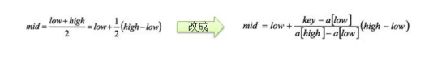

# 查找算法

## 一、查找算法介绍

常用的查找有4种：

- 顺序查找
- 二分查找/折半查找
- 插值查找
- 斐波那契查找

## 二、线性查找算法

有一个数列，{1,8,10,89,1000,1234} 判断数列中是否包含此名称，要求，如果找到了就提示找到并给出下标值。

```java
package com.zixin.learn.sgg.datastructure.search;

public class SeqSearch {

	public static void main(String[] args) {
		int arr[] = { 1, 9, 11, -1, 34, 89 };// 没有顺序的数组
		int index = seqSearch(arr, -11);
		if(index == -1) {
			System.out.println("没有找到到");
		} else {
			System.out.println("找到，下标为=" + index);
		}
	}

	/**
	 * 这里我们实现的线性查找是找到一个满足条件的值，就返回
	 * @param arr
	 * @param value
	 * @return
	 */
	public static int seqSearch(int[] arr, int value) {
		// 线性查找是逐一比对，发现有相同值，就返回下标
		for (int i = 0; i < arr.length; i++) {
			if(arr[i] == value) {
				return i;
			}
		}
		return -1;
	}

}

```

## 三、二分查找

1. 二分查找

   对一个有序数组进行二分查找，输入一个数看看改数组是否存在此数，并且求出下标，如果没有就提示没有这个数。

2. 思路

   - 先确定数组的中间的下标
   - 然后让需要查找的值和中间的值进行比较

     - 如果要找的值大于中间值，说明在右边，递归向右查找
     - 如果要找的值小于中间值，说明在左边，递归向左查找
     - 相等，说明找到了
    - 什么时候结束递归
      - 找到就结束递归
      - 递归完整个数组，仍然没有找到，也需要结束递归，当left>right的时候需要退出

3. 代码

   ```java
   package com.zixin.learn.sgg.datastructure.search;
   
   import java.util.ArrayList;
   import java.util.List;
   
   //注意：使用二分查找的前提是 该数组是有序的.
   public class BinarySearch {
   
   	public static void main(String[] args) {
   		//int arr[] = { 1, 8, 10, 89,1000,1000, 1234 };
   		int arr[] = { 1, 2, 3, 4, 5, 6, 7, 8, 9, 10 , 11, 12, 13,14,15,16,17,18,19,20 };
   		
   
   		//
   //		int resIndex = binarySearch(arr, 0, arr.length - 1, 1000);
   //		System.out.println("resIndex=" + resIndex);
   		
   		List<Integer> resIndexList = binarySearch2(arr, 0, arr.length - 1, 1);
   		System.out.println("resIndexList=" + resIndexList);
   	}
   
   	// 二分查找算法
   	/**
   	 * 
   	 * @param arr
   	 *            数组
   	 * @param left
   	 *            左边的索引
   	 * @param right
   	 *            右边的索引
   	 * @param findVal
   	 *            要查找的值
   	 * @return 如果找到就返回下标，如果没有找到，就返回 -1
   	 */
   	public static int binarySearch(int[] arr, int left, int right, int findVal) {
   		
   
   		// 当 left > right 时，说明递归整个数组，但是没有找到
   		if (left > right) {
   			return -1;
   		}
   		int mid = (left + right) / 2;
   		int midVal = arr[mid];
   
   		if (findVal > midVal) { // 向 右递归
   			return binarySearch(arr, mid + 1, right, findVal);
   		} else if (findVal < midVal) { // 向左递归
   			return binarySearch(arr, left, mid - 1, findVal);
   		} else {
   			
   			return mid;
   		}
   
   	}
   	
   	//完成一个课后思考题:
   	/*
   	 * 课后思考题： {1,8, 10, 89, 1000, 1000，1234} 当一个有序数组中，
   	 * 有多个相同的数值时，如何将所有的数值都查找到，比如这里的 1000
   	 * 
   	 * 思路分析
   	 * 1. 在找到mid 索引值，不要马上返回
   	 * 2. 向mid 索引值的左边扫描，将所有满足 1000， 的元素的下标，加入到集合ArrayList
   	 * 3. 向mid 索引值的右边扫描，将所有满足 1000， 的元素的下标，加入到集合ArrayList
   	 * 4. 将Arraylist返回
   	 */
   
   	public static List<Integer> binarySearch2(int[] arr, int left, int right, int findVal) {
   
   		System.out.println("hello~");
   		// 当 left > right 时，说明递归整个数组，但是没有找到
   		if (left > right) {
   			return new ArrayList<Integer>();
   		}
   		int mid = (left + right) / 2;
   		int midVal = arr[mid];
   
   		if (findVal > midVal) { // 向 右递归
   			return binarySearch2(arr, mid + 1, right, findVal);
   		} else if (findVal < midVal) { // 向左递归
   			return binarySearch2(arr, left, mid - 1, findVal);
   		} else {
   //			 * 思路分析
   //			 * 1. 在找到mid 索引值，不要马上返回
   //			 * 2. 向mid 索引值的左边扫描，将所有满足 1000， 的元素的下标，加入到集合ArrayList
   //			 * 3. 向mid 索引值的右边扫描，将所有满足 1000， 的元素的下标，加入到集合ArrayList
   //			 * 4. 将Arraylist返回
   			
   			List<Integer> resIndexlist = new ArrayList<Integer>();
   			//向mid 索引值的左边扫描，将所有满足 1000， 的元素的下标，加入到集合ArrayList
   			int temp = mid - 1;
   			while(true) {
   				if (temp < 0 || arr[temp] != findVal) {//退出
   					break;
   				}
   				//否则，就temp 放入到 resIndexlist
   				resIndexlist.add(temp);
   				temp -= 1; //temp左移
   			}
   			resIndexlist.add(mid);  //
   			
   			//向mid 索引值的右边扫描，将所有满足 1000， 的元素的下标，加入到集合ArrayList
   			temp = mid + 1;
   			while(true) {
   				if (temp > arr.length - 1 || arr[temp] != findVal) {//退出
   					break;
   				}
   				//否则，就temp 放入到 resIndexlist
   				resIndexlist.add(temp);
   				temp += 1; //temp右移
   			}
   			
   			return resIndexlist;
   		}
   
   	}
   }
   
   ```

   

## 四、插值查找算法

1. 原理：

   - 类似于二分查找，不同的是插值查找每次从自适应mid处开始查找

   - 将折半查找中求mid索引的公式换为

     

2. 代码实现

   ```java
   package com.zixin.learn.sgg.datastructure.search;
   
   import java.util.Arrays;
   
   public class InsertValueSearch {
   
   	public static void main(String[] args) {
   		
   //		int [] arr = new int[100];
   //		for(int i = 0; i < 100; i++) {
   //			arr[i] = i + 1;
   //		}
   		
   		int arr[] = { 1, 8, 10, 89,1000,1000, 1234 };
   		
   		int index = insertValueSearch(arr, 0, arr.length - 1, 1234);
   		//int index = binarySearch(arr, 0, arr.length, 1);
   		System.out.println("index = " + index);
   		
   		//System.out.println(Arrays.toString(arr));
   	}
   	
   	public static int binarySearch(int[] arr, int left, int right, int findVal) {
   		System.out.println("二分查找被调用~");
   		// 当 left > right 时，说明递归整个数组，但是没有找到
   		if (left > right) {
   			return -1;
   		}
   		int mid = (left + right) / 2;
   		int midVal = arr[mid];
   
   		if (findVal > midVal) { // 向 右递归
   			return binarySearch(arr, mid + 1, right, findVal);
   		} else if (findVal < midVal) { // 向左递归
   			return binarySearch(arr, left, mid - 1, findVal);
   		} else {
   
   			return mid;
   		}
   
   	}
   
   	//编写插值查找算法
   	//说明：插值查找算法，也要求数组是有序的
   	/**
   	 * 
   	 * @param arr 数组
   	 * @param left 左边索引
   	 * @param right 右边索引
   	 * @param findVal 查找值
   	 * @return 如果找到，就返回对应的下标，如果没有找到，返回-1
   	 */
   	public static int insertValueSearch(int[] arr, int left, int right, int findVal) { 
   
   		System.out.println("插值查找次数~~");
   		
   		//注意：findVal < arr[0]  和  findVal > arr[arr.length - 1] 必须需要
   		//否则我们得到的 mid 可能越界
   		if (left > right || findVal < arr[0] || findVal > arr[arr.length - 1]) {
   			return -1;
   		}
   
   		// 求出mid, 自适应
   		int mid = left + (right - left) * (findVal - arr[left]) / (arr[right] - arr[left]);
   		int midVal = arr[mid];
   		if (findVal > midVal) { // 说明应该向右边递归
   			return insertValueSearch(arr, mid + 1, right, findVal);
   		} else if (findVal < midVal) { // 说明向左递归查找
   			return insertValueSearch(arr, left, mid - 1, findVal);
   		} else {
   			return mid;
   		}
   
   	}
   }
   
   ```

   

3. 注意事项
   - 对于数据量较大，关键字分布比较均匀的查找表来说，采用插值查找，速度较快。
   - 关键字分布不均匀的情况下，该方法不一定比折半查找要好。

## 五、斐波那契查找算法

1. 介绍

   黄金分割点是指把一条线段分割为两部分，使其中一部分与全长之比等于另一部分与这部分之比。取其前三位的数字的近似值为0.618.由于按此比例设计的造型十分美丽，因此称为黄金分割，也称为中外比。

2. 原理

   与前两种类似，仅仅改变了中间结点的位置，mid=low+F(k-1)-1

   

3. 对F（k-1）-1的理解

   - 由斐波那契数列F[k]=F[k-1]+F[k-2]的性质，可得到(F[k]-1)=(F[k-1]-1)+(F[k-2]-1)+1,说明只要顺序表的长度为F[k]-1,则可以将该表分成长度为F[k-1]-1和F[k-2]-1的两段，从而中间的位置为mid=low+F[k-1]-1

   - 但是由于表长n不一定刚好等于F[k]-1,所以需要将原来的顺序表长度n增加至F[k]-1.这里的k值只要能使得F[k]-1恰好大于或等于n即可，顺序表长度增加后，新增的位置都赋为n位置的值即可。

     

4. 代码实现

   ```java
   package com.zixin.learn.sgg.datastructure.search;
   
   import java.util.Arrays;
   
   public class FibonacciSearch {
   
   	public static int maxSize = 20;
   	public static void main(String[] args) {
   		int [] arr = {1,8, 10, 89, 1000, 1234};
   		
   		System.out.println("index=" + fibSearch(arr, 89));// 0
   		
   	}
   
   	//因为后面我们mid=low+F(k-1)-1，需要使用到斐波那契数列，因此我们需要先获取到一个斐波那契数列
   	//非递归方法得到一个斐波那契数列
   	public static int[] fib() {
   		int[] f = new int[maxSize];
   		f[0] = 1;
   		f[1] = 1;
   		for (int i = 2; i < maxSize; i++) {
   			f[i] = f[i - 1] + f[i - 2];
   		}
   		return f;
   	}
   	
   	//编写斐波那契查找算法
   	//使用非递归的方式编写算法
   	/**
   	 * 
   	 * @param a  数组
   	 * @param key 我们需要查找的关键码(值)
   	 * @return 返回对应的下标，如果没有-1
   	 */
   	public static int fibSearch(int[] a, int key) {
   		int low = 0;
   		int high = a.length - 1;
   		int k = 0; //表示斐波那契分割数值的下标
   		int mid = 0; //存放mid值
   		int f[] = fib(); //获取到斐波那契数列
   		//获取到斐波那契分割数值的下标
   		while(high > f[k] - 1) {
   			k++;
   		}
   		//因为 f[k] 值 可能大于 a 的 长度，因此我们需要使用Arrays类，构造一个新的数组，并指向temp[]
   		//不足的部分会使用0填充
   		int[] temp = Arrays.copyOf(a, f[k]);
   		//实际上需求使用a数组最后的数填充 temp
   		//举例:
   		//temp = {1,8, 10, 89, 1000, 1234, 0, 0}  => {1,8, 10, 89, 1000, 1234, 1234, 1234,}
   		for(int i = high + 1; i < temp.length; i++) {
   			temp[i] = a[high];
   		}
   		
   		// 使用while来循环处理，找到我们的数 key
   		while (low <= high) { // 只要这个条件满足，就可以找
   			mid = low + f[k - 1] - 1;
   			if(key < temp[mid]) { //我们应该继续向数组的前面查找(左边)
   				high = mid - 1;
   				//为甚是 k--
   				//说明
   				//1. 全部元素 = 前面的元素 + 后边元素
   				//2. f[k] = f[k-1] + f[k-2]
   				//因为 前面有 f[k-1]个元素,所以可以继续拆分 f[k-1] = f[k-2] + f[k-3]
   				//即 在 f[k-1] 的前面继续查找 k--
   				//即下次循环 mid = f[k-1-1]-1
   				k--;
   			} else if ( key > temp[mid]) { // 我们应该继续向数组的后面查找(右边)
   				low = mid + 1;
   				//为什么是k -=2
   				//说明
   				//1. 全部元素 = 前面的元素 + 后边元素
   				//2. f[k] = f[k-1] + f[k-2]
   				//3. 因为后面我们有f[k-2] 所以可以继续拆分 f[k-1] = f[k-3] + f[k-4]
   				//4. 即在f[k-2] 的前面进行查找 k -=2
   				//5. 即下次循环 mid = f[k - 1 - 2] - 1
   				k -= 2;
   			} else { //找到
   				//需要确定，返回的是哪个下标
   				if(mid <= high) {
   					return mid;
   				} else {
   					return high;
   				}
   			}
   		}
   		return -1;
   	}
   }
   
   ```

   