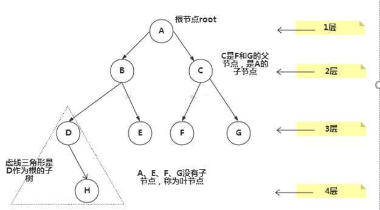
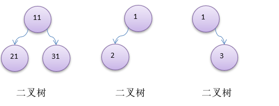
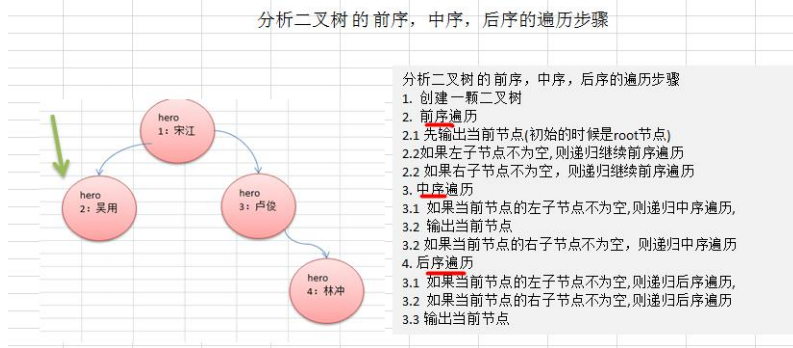
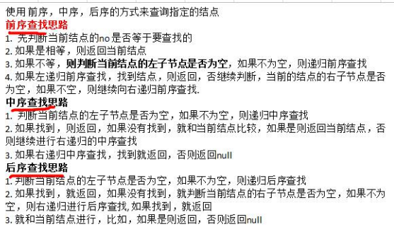
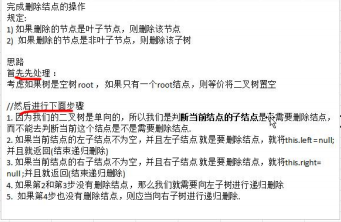
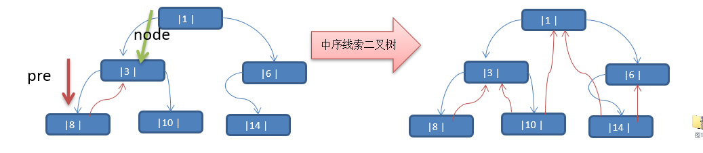

# 树结构基础部分

## 树

### 为什么需要树这种数据结构

1. 数组存储方式的分析
    优点：通过下标方式访问元素，速度快。**对于有序数组**，还可使用二分查找提高检索速度。
    缺点：如果要检索具体某个值，或者插入值(按一定顺序)**会整体移动**，效率较低 [示意图]

2. 链式存储方式的分析
    优点：在一定程度上对数组存储方式有优化(比如：插入一个数值节点，只需要将插入节点，链接到链表中即可， 删除效率也很好)。
    缺点：在进行检索时，效率仍然较低，比如(检索某个值，需要从头节点开始遍历) 

3. 树存储方式的分析
    能提高数据**存储，读取**的效率, 比如利用 **二叉排序树**(Binary Sort Tree)，既可以保证数据的检索速度，同时也可以保证数据的插入，删除，修改的速度。

### 树的常用术语



1)节点

2)根节点

3)父节点

4)子节点

5)叶子节点 (没有子节点的节点)

6)节点的权(节点值)

7)路径(从root节点找到该节点的路线)

8)层

9)子树

10)树的高度(最大层数)

11)森林 :多颗子树构成森林

## 二叉树

1. 树有很多种，每个节点**最多只能有两个子节点**的一种形式称为二叉树。

2. 二叉树的子节点分为左节点和右节点。

3. 三种形式

   

4. 如果该二叉树的所有叶子节点都在最后一层，并且结点总数= 2^n -1 , n 为层数，则我们称为满二叉树。

5. 如果该二叉树的所有叶子节点都在最后一层或者倒数第二层，而且最后一层的叶子节点在左边连续，倒数第二层的叶子节点在右边连续，我们称为完全二叉树。

#### 二叉树遍历
   前序遍历: **先输出父节点**，再遍历左子树和右子树

   中序遍历: 先遍历左子树，**再输出父节点**，再遍历右子树

   后序遍历: 先遍历左子树，再遍历右子树，**最后输出父节点**

   **小结**: 看输出父节点的顺序，就确定是前序，中序还是后序

1. 二叉树遍历应用实例

   

2. 代码实现

   ```java
   package com.zixin.learn.sgg.datastructure.tree;
   
   public class BinaryTreeDemo {
   
   	public static void main(String[] args) {
   		//先需要创建一颗二叉树
   		BinaryTree binaryTree = new BinaryTree();
   		//创建需要的结点
   		HeroNode root = new HeroNode(1, "宋江");
   		HeroNode node2 = new HeroNode(2, "吴用");
   		HeroNode node3 = new HeroNode(3, "卢俊义");
   		HeroNode node4 = new HeroNode(4, "林冲");
   		HeroNode node5 = new HeroNode(5, "关胜");
   		
   		//说明，我们先手动创建该二叉树，后面我们学习递归的方式创建二叉树
   		root.setLeft(node2);
   		root.setRight(node3);
   		node3.setRight(node4);
   		node3.setLeft(node5);
   		binaryTree.setRoot(root);
   		
   		//测试
   		System.out.println("前序遍历"); // 1,2,3,5,4
   		binaryTree.preOrder();
   		
   		//测试 
   	System.out.println("中序遍历");
   		binaryTree.infixOrder(); // 2,1,5,3,4
   //		
   		System.out.println("后序遍历");
           binaryTree.postOrder(); // 2,5,4,3,1
   		
   	}
   
   }
   
   //定义BinaryTree 二叉树
   class BinaryTree {
   	private HeroNode root;
   
   	public void setRoot(HeroNode root) {
   		this.root = root;
   	}
   	
   
   	//前序遍历
   	public void preOrder() {
   		if(this.root != null) {
   			this.root.preOrder();
   		}else {
   			System.out.println("二叉树为空，无法遍历");
   		}
   	}
   	
   	//中序遍历
   	public void infixOrder() {
   		if(this.root != null) {
   			this.root.infixOrder();
   		}else {
   			System.out.println("二叉树为空，无法遍历");
   		}
   	}
   	//后序遍历
   	public void postOrder() {
   		if(this.root != null) {
   			this.root.postOrder();
   		}else {
   			System.out.println("二叉树为空，无法遍历");
   		}
   	}
   	
   	
   }
   
   //先创建HeroNode 结点
   class HeroNode {
   	private int no;
   	private String name;
   	private HeroNode left; //默认null
   	private HeroNode right; //默认null
   	public HeroNode(int no, String name) {
   		this.no = no;
   		this.name = name;
   	}
   	public int getNo() {
   		return no;
   	}
   	public void setNo(int no) {
   		this.no = no;
   	}
   	public String getName() {
   		return name;
   	}
   	public void setName(String name) {
   		this.name = name;
   	}
   	public HeroNode getLeft() {
   		return left;
   	}
   	public void setLeft(HeroNode left) {
   		this.left = left;
   	}
   	public HeroNode getRight() {
   		return right;
   	}
   	public void setRight(HeroNode right) {
   		this.right = right;
   	}
   	@Override
   	public String toString() {
   		return "HeroNode [no=" + no + ", name=" + name + "]";
   	}
   	
   	
   	//编写前序遍历的方法
   	public void preOrder() {
   		System.out.println(this); //先输出父结点
   		//递归向左子树前序遍历
   		if(this.left != null) {
   			this.left.preOrder();
   		}
   		//递归向右子树前序遍历
   		if(this.right != null) {
   			this.right.preOrder();
   		}
   	}
   	//中序遍历
   	public void infixOrder() {
   		
   		//递归向左子树中序遍历
   		if(this.left != null) {
   			this.left.infixOrder();
   		}
   		//输出父结点
   		System.out.println(this);
   		//递归向右子树中序遍历
   		if(this.right != null) {
   			this.right.infixOrder();
   		}
   	}
   	//后序遍历
   	public void postOrder() {
   		if(this.left != null) {
   			this.left.postOrder();
   		}
   		if(this.right != null) {
   			this.right.postOrder();
   		}
   		System.out.println(this);
   	}
   	
   	
   	
   	
   	
   	
   }
   
   //
   
   
   
   ```


#### 二叉树查找

1. 要求

1)请编写前序查找，中序查找和后序查找的方法。

2)并分别使用三种查找方式，查找 heroNO = 5 的节点

3)并分析各种查找方式，分别比较了多少次



2. 代码实现

   ```java
   //前序遍历查找
   	/**
   	 * 
   	 * @param no 查找no
   	 * @return 如果找到就返回该Node ,如果没有找到返回 null
   	 */
   	public HeroNode preOrderSearch(int no) {
   		System.out.println("进入前序遍历");
   		//比较当前结点是不是
   		if(this.no == no) {
   			return this;
   		}
   		//1.则判断当前结点的左子节点是否为空，如果不为空，则递归前序查找
   		//2.如果左递归前序查找，找到结点，则返回
   		HeroNode resNode = null;
   		if(this.left != null) {
   			resNode = this.left.preOrderSearch(no);
   		}
   		if(resNode != null) {//说明我们左子树找到
   			return resNode;
   		}
   		//1.左递归前序查找，找到结点，则返回，否继续判断，
   		//2.当前的结点的右子节点是否为空，如果不空，则继续向右递归前序查找
   		if(this.right != null) {
   			resNode = this.right.preOrderSearch(no);
   		}
   		return resNode;
   	}
   	
   	//中序遍历查找
   	public HeroNode infixOrderSearch(int no) {
   		//判断当前结点的左子节点是否为空，如果不为空，则递归中序查找
   		HeroNode resNode = null;
   		if(this.left != null) {
   			resNode = this.left.infixOrderSearch(no);
   		}
   		if(resNode != null) {
   			return resNode;
   		}
   		System.out.println("进入中序查找");
   		//如果找到，则返回，如果没有找到，就和当前结点比较，如果是则返回当前结点
   		if(this.no == no) {
   			return this;
   		}
   		//否则继续进行右递归的中序查找
   		if(this.right != null) {
   			resNode = this.right.infixOrderSearch(no);
   		}
   		return resNode;
   		
   	}
   	
   	//后序遍历查找
   	public HeroNode postOrderSearch(int no) {
   		
   		//判断当前结点的左子节点是否为空，如果不为空，则递归后序查找
   		HeroNode resNode = null;
   		if(this.left != null) {
   			resNode = this.left.postOrderSearch(no);
   		}
   		if(resNode != null) {//说明在左子树找到
   			return resNode;
   		}
   		
   		//如果左子树没有找到，则向右子树递归进行后序遍历查找
   		if(this.right != null) {
   			resNode = this.right.postOrderSearch(no);
   		}
   		if(resNode != null) {
   			return resNode;
   		}
   		System.out.println("进入后序查找");
   		//如果左右子树都没有找到，就比较当前结点是不是
   		if(this.no == no) {
   			return this;
   		}
   		return resNode;
   	}
   ```

   

#### 二叉树删除

1. 要求
   - 如果删除的节点是叶节点，则删除该节点
   - 如果删除的节点是非叶节点，则删除该子树

2. 思路

   

3. 代码

   ```java
   HeroNode:
   //递归删除结点
   	//1.如果删除的节点是叶子节点，则删除该节点
   	//2.如果删除的节点是非叶子节点，则删除该子树
   	public void delNode(int no) {
   		
   		//思路
   		/*
   		 * 	1. 因为我们的二叉树是单向的，所以我们是判断当前结点的子结点是否需要删除结点，而不能去判断当前这个结点是不是需要删除结点.
   			2. 如果当前结点的左子结点不为空，并且左子结点 就是要删除结点，就将this.left = null; 并且就返回(结束递归删除)
   			3. 如果当前结点的右子结点不为空，并且右子结点 就是要删除结点，就将this.right= null ;并且就返回(结束递归删除)
   			4. 如果第2和第3步没有删除结点，那么我们就需要向左子树进行递归删除
   			5.  如果第4步也没有删除结点，则应当向右子树进行递归删除.
   
   		 */
   		//2. 如果当前结点的左子结点不为空，并且左子结点 就是要删除结点，就将this.left = null; 并且就返回(结束递归删除)
   		if(this.left != null && this.left.no == no) {
   			this.left = null;
   			return;
   		}
   		//3.如果当前结点的右子结点不为空，并且右子结点 就是要删除结点，就将this.right= null ;并且就返回(结束递归删除)
   		if(this.right != null && this.right.no == no) {
   			this.right = null;
   			return;
   		}
   		//4.我们就需要向左子树进行递归删除
   		if(this.left != null) {
   			this.left.delNode(no);
   		}
   		//5.则应当向右子树进行递归删除
   		if(this.right != null) {
   			this.right.delNode(no);
   		}
   	}
   
   BinaryTree:
   //删除结点
   	public void delNode(int no) {
   		if(root != null) {
   			//如果只有一个root结点, 这里立即判断root是不是就是要删除结点
   			if(root.getNo() == no) {
   				root = null;
   			} else {
   				//递归删除
   				root.delNode(no);
   			}
   		}else{
   			System.out.println("空树，不能删除~");
   		}
   	}
   ```

   


#### 顺序存储二叉树

Ø基本说明

从数据存储来看，**数组存储方式**和树的存储方式可以相互转换，即数组可以转换成树，树也可以转换成数组，

要求:

1)右图的二叉树的结点，要求以数组 的方式来存放 arr : [1, 2, 3, 4, 5, 6, 6]

2)要求在遍历数组 arr时，仍然可以以前序遍历**，**中序遍历**和**后序遍历的
 方式完成结点的遍历


Ø顺序存储二叉树的**特点**:

1)顺序二叉树通常只考虑完全二叉树

2)第n个元素的左子节点为 2 * n + 1 

3)第n个元素的右子节点为 2 * n + 2

4)第n个元素的父节点为 (n-1) / 2

5)n : 表示二叉树中的第几个元素(按0开始编号)

#### 顺序存储二叉树遍历

需求: 给你一个数组 *{*1,2,3,4,5,6,7}，要求以二叉树前序遍历的方式进行遍历。 前序遍历的结果应当为 1,2,4,5,3,6,7

```java
package com.zixin.learn.sgg.datastructure.tree;

/**
 * 
 * @ClassName: ArrBinaryTreeDemo
 * @Description: 顺序存储二叉树遍历
 * @author Administrator
 * @date 2020-03-10 23:22:38
 */
public class ArrBinaryTreeDemo {

	public static void main(String[] args) {
		int[] arr = { 1, 2, 3, 4, 5, 6, 7 };
		//创建一个 ArrBinaryTree
		ArrBinaryTree arrBinaryTree = new ArrBinaryTree(arr);
		arrBinaryTree.preOrder(); // 1,2,4,5,3,6,7
	}

}

//编写一个ArrayBinaryTree, 实现顺序存储二叉树遍历

class ArrBinaryTree {
	private int[] arr;//存储数据结点的数组

	public ArrBinaryTree(int[] arr) {
		this.arr = arr;
	}
	
	//重载preOrder
	public void preOrder() {
		this.preOrder(0);
	}
	
	//编写一个方法，完成顺序存储二叉树的前序遍历
	/**
	 * 
	 * @param index 数组的下标 
	 */
	public void preOrder(int index) {
		//如果数组为空，或者 arr.length = 0
		if(arr == null || arr.length == 0) {
			System.out.println("数组为空，不能按照二叉树的前序遍历");
		}
		//输出当前这个元素
		System.out.println(arr[index]); 
		//向左递归遍历
		if((index * 2 + 1) < arr.length) {
			preOrder(2 * index + 1 );
		}
		//向右递归遍历
		if((index * 2 + 2) < arr.length) {
			preOrder(2 * index + 2);
		}
	}
	
}

```

#### 线索化二叉树

**线索二叉树应用案例**

**思路分析**: 中序遍历的结果：{8, 3, 10, 1, 14, 6}



说明:当线索化二叉树后，Node节点的 属性 **left** **和** **right** ，有如下情况:

1)left 指向的是左子树，也可能是指向的前驱节点. 比如 ① 节点 left 指向的左子树, 而 ⑩ 节点的 left 指向的就是前驱节点.

2)right指向的是右子树，也可能是指向后继节点，比如 ① 节点right 指向的是右子树，而⑩ 节点的right 指向的是后继节点.

**遍历线索化二叉树**

说明：对前面的中序线索化的二叉树， 进行遍历

分析：因为线索化后，各个结点指向有变化，因此**原来的遍历方式不能使用**，这时需要使用新的方式**遍历线索化二叉树**，各个节点可以通过线型方式遍历，因此无需使用递归方式，这样也提高了遍历的效率。 遍历的次序应当和中序遍历保持一致。

```java
package com.zixin.learn.sgg.datastructure.tree.threadedbinarytree;


public class ThreadedBinaryTreeDemo {

	public static void main(String[] args) {
		//测试一把中序线索二叉树的功能
		HeroNode root = new HeroNode(1, "tom");
		HeroNode node2 = new HeroNode(3, "jack");
		HeroNode node3 = new HeroNode(6, "smith");
		HeroNode node4 = new HeroNode(8, "mary");
		HeroNode node5 = new HeroNode(10, "king");
		HeroNode node6 = new HeroNode(14, "dim");
		
		//二叉树，后面我们要递归创建, 现在简单处理使用手动创建
		root.setLeft(node2);
		root.setRight(node3);
		node2.setLeft(node4);
		node2.setRight(node5);
		node3.setLeft(node6);
		
		//测试中序线索化
		ThreadedBinaryTree threadedBinaryTree = new ThreadedBinaryTree();
		threadedBinaryTree.setRoot(root);
		threadedBinaryTree.threadedNodes();
		
		//测试: 以10号节点测试
		HeroNode leftNode = node5.getLeft();
		HeroNode rightNode = node5.getRight();
		System.out.println("10号结点的前驱结点是 ="  + leftNode); //3
		System.out.println("10号结点的后继结点是="  + rightNode); //1
		
		//当线索化二叉树后，不能在使用原来的遍历方法
		//threadedBinaryTree.infixOrder();
		System.out.println("使用线索化的方式遍历 线索化二叉树");
		threadedBinaryTree.threadedList(); // 8, 3, 10, 1, 14, 6
		
	}

}


//定义ThreadedBinaryTree 实现了线索化功能的二叉树
class ThreadedBinaryTree {
	private HeroNode root;
	
	//为了实现线索化，需要创建要给指向当前结点的前驱结点的指针
	//在递归进行线索化时，pre 总是保留前一个结点
	private HeroNode pre = null;

	public void setRoot(HeroNode root) {
		this.root = root;
	}
	
	//重载一把threadedNodes方法
	public void threadedNodes() {
		this.threadedNodes(root);
	}
	
	//遍历线索化二叉树的方法
	public void threadedList() {
		//定义一个变量，存储当前遍历的结点，从root开始
		HeroNode node = root;
		while(node != null) {
			//循环的找到leftType == 1的结点，第一个找到就是8结点
			//后面随着遍历而变化,因为当leftType==1时，说明该结点是按照线索化
			//处理后的有效结点
			while(node.getLeftType() == 0) {
				node = node.getLeft();
			}
			
			//打印当前这个结点
			System.out.println(node);
			//如果当前结点的右指针指向的是后继结点,就一直输出
			while(node.getRightType() == 1) {
				//获取到当前结点的后继结点
				node = node.getRight();
				System.out.println(node);
			}
			//替换这个遍历的结点
			node = node.getRight();
			
		}
	}
	
	//编写对二叉树进行中序线索化的方法
	/**
	 * 
	 * @param node 就是当前需要线索化的结点
	 */
	public void threadedNodes(HeroNode node) {
		
		//如果node==null, 不能线索化
		if(node == null) {
			return;
		}
		
		//(一)先线索化左子树
		threadedNodes(node.getLeft());
		//(二)线索化当前结点[有难度]
		
		//处理当前结点的前驱结点
		//以8结点来理解
		//8结点的.left = null , 8结点的.leftType = 1
		if(node.getLeft() == null) {
			//让当前结点的左指针指向前驱结点 
			node.setLeft(pre); 
			//修改当前结点的左指针的类型,指向前驱结点
			node.setLeftType(1);
		}
		
		//处理后继结点   其实是下次处理的时候用移动后的pre结点来处理的
		if (pre != null && pre.getRight() == null) {
			//让前驱结点的右指针指向当前结点
			pre.setRight(node);
			//修改前驱结点的右指针类型
			pre.setRightType(1);
		}
		//!!! 每处理一个结点后，让当前结点是下一个结点的前驱结点
		pre = node;
		
		//(三)在线索化右子树
		threadedNodes(node.getRight());
		
		
	}
	
	//删除结点
	public void delNode(int no) {
		if(root != null) {
			//如果只有一个root结点, 这里立即判断root是不是就是要删除结点
			if(root.getNo() == no) {
				root = null;
			} else {
				//递归删除
				root.delNode(no);
			}
		}else{
			System.out.println("空树，不能删除~");
		}
	}
	//前序遍历
	public void preOrder() {
		if(this.root != null) {
			this.root.preOrder();
		}else {
			System.out.println("二叉树为空，无法遍历");
		}
	}
	
	//中序遍历
	public void infixOrder() {
		if(this.root != null) {
			this.root.infixOrder();
		}else {
			System.out.println("二叉树为空，无法遍历");
		}
	}
	//后序遍历
	public void postOrder() {
		if(this.root != null) {
			this.root.postOrder();
		}else {
			System.out.println("二叉树为空，无法遍历");
		}
	}
	
	//前序遍历
	public HeroNode preOrderSearch(int no) {
		if(root != null) {
			return root.preOrderSearch(no);
		} else {
			return null;
		}
	}
	//中序遍历
	public HeroNode infixOrderSearch(int no) {
		if(root != null) {
			return root.infixOrderSearch(no);
		}else {
			return null;
		}
	}
	//后序遍历
	public HeroNode postOrderSearch(int no) {
		if(root != null) {
			return this.root.postOrderSearch(no);
		}else {
			return null;
		}
	}
}

//先创建HeroNode 结点
class HeroNode {
	private int no;
	private String name;
	private HeroNode left; //默认null
	private HeroNode right; //默认null
	//说明
	//1. 如果leftType == 0 表示指向的是左子树, 如果 1 则表示指向前驱结点
	//2. 如果rightType == 0 表示指向是右子树, 如果 1表示指向后继结点
	private int leftType;
	private int rightType;
	
	
	
	public int getLeftType() {
		return leftType;
	}
	public void setLeftType(int leftType) {
		this.leftType = leftType;
	}
	public int getRightType() {
		return rightType;
	}
	public void setRightType(int rightType) {
		this.rightType = rightType;
	}
	public HeroNode(int no, String name) {
		this.no = no;
		this.name = name;
	}
	public int getNo() {
		return no;
	}
	public void setNo(int no) {
		this.no = no;
	}
	public String getName() {
		return name;
	}
	public void setName(String name) {
		this.name = name;
	}
	public HeroNode getLeft() {
		return left;
	}
	public void setLeft(HeroNode left) {
		this.left = left;
	}
	public HeroNode getRight() {
		return right;
	}
	public void setRight(HeroNode right) {
		this.right = right;
	}
	@Override
	public String toString() {
		return "HeroNode [no=" + no + ", name=" + name + "]";
	}
	
	//递归删除结点
	//1.如果删除的节点是叶子节点，则删除该节点
	//2.如果删除的节点是非叶子节点，则删除该子树
	public void delNode(int no) {
		
		//思路
		/*
		 * 	1. 因为我们的二叉树是单向的，所以我们是判断当前结点的子结点是否需要删除结点，而不能去判断当前这个结点是不是需要删除结点.
			2. 如果当前结点的左子结点不为空，并且左子结点 就是要删除结点，就将this.left = null; 并且就返回(结束递归删除)
			3. 如果当前结点的右子结点不为空，并且右子结点 就是要删除结点，就将this.right= null ;并且就返回(结束递归删除)
			4. 如果第2和第3步没有删除结点，那么我们就需要向左子树进行递归删除
			5.  如果第4步也没有删除结点，则应当向右子树进行递归删除.

		 */
		//2. 如果当前结点的左子结点不为空，并且左子结点 就是要删除结点，就将this.left = null; 并且就返回(结束递归删除)
		if(this.left != null && this.left.no == no) {
			this.left = null;
			return;
		}
		//3.如果当前结点的右子结点不为空，并且右子结点 就是要删除结点，就将this.right= null ;并且就返回(结束递归删除)
		if(this.right != null && this.right.no == no) {
			this.right = null;
			return;
		}
		//4.我们就需要向左子树进行递归删除
		if(this.left != null) {
			this.left.delNode(no);
		}
		//5.则应当向右子树进行递归删除
		if(this.right != null) {
			this.right.delNode(no);
		}
	}
	
	//编写前序遍历的方法
	public void preOrder() {
		System.out.println(this); //先输出父结点
		//递归向左子树前序遍历
		if(this.left != null) {
			this.left.preOrder();
		}
		//递归向右子树前序遍历
		if(this.right != null) {
			this.right.preOrder();
		}
	}
	//中序遍历
	public void infixOrder() {
		
		//递归向左子树中序遍历
		if(this.left != null) {
			this.left.infixOrder();
		}
		//输出父结点
		System.out.println(this);
		//递归向右子树中序遍历
		if(this.right != null) {
			this.right.infixOrder();
		}
	}
	//后序遍历
	public void postOrder() {
		if(this.left != null) {
			this.left.postOrder();
		}
		if(this.right != null) {
			this.right.postOrder();
		}
		System.out.println(this);
	}
	
	//前序遍历查找
	/**
	 * 
	 * @param no 查找no
	 * @return 如果找到就返回该Node ,如果没有找到返回 null
	 */
	public HeroNode preOrderSearch(int no) {
		System.out.println("进入前序遍历");
		//比较当前结点是不是
		if(this.no == no) {
			return this;
		}
		//1.则判断当前结点的左子节点是否为空，如果不为空，则递归前序查找
		//2.如果左递归前序查找，找到结点，则返回
		HeroNode resNode = null;
		if(this.left != null) {
			resNode = this.left.preOrderSearch(no);
		}
		if(resNode != null) {//说明我们左子树找到
			return resNode;
		}
		//1.左递归前序查找，找到结点，则返回，否继续判断，
		//2.当前的结点的右子节点是否为空，如果不空，则继续向右递归前序查找
		if(this.right != null) {
			resNode = this.right.preOrderSearch(no);
		}
		return resNode;
	}
	
	//中序遍历查找
	public HeroNode infixOrderSearch(int no) {
		//判断当前结点的左子节点是否为空，如果不为空，则递归中序查找
		HeroNode resNode = null;
		if(this.left != null) {
			resNode = this.left.infixOrderSearch(no);
		}
		if(resNode != null) {
			return resNode;
		}
		System.out.println("进入中序查找");
		//如果找到，则返回，如果没有找到，就和当前结点比较，如果是则返回当前结点
		if(this.no == no) {
			return this;
		}
		//否则继续进行右递归的中序查找
		if(this.right != null) {
			resNode = this.right.infixOrderSearch(no);
		}
		return resNode;
		
	}
	
	//后序遍历查找
	public HeroNode postOrderSearch(int no) {
		
		//判断当前结点的左子节点是否为空，如果不为空，则递归后序查找
		HeroNode resNode = null;
		if(this.left != null) {
			resNode = this.left.postOrderSearch(no);
		}
		if(resNode != null) {//说明在左子树找到
			return resNode;
		}
		
		//如果左子树没有找到，则向右子树递归进行后序遍历查找
		if(this.right != null) {
			resNode = this.right.postOrderSearch(no);
		}
		if(resNode != null) {
			return resNode;
		}
		System.out.println("进入后序查找");
		//如果左右子树都没有找到，就比较当前结点是不是
		if(this.no == no) {
			return this;
		}
		return resNode;
	}
	
}

```

