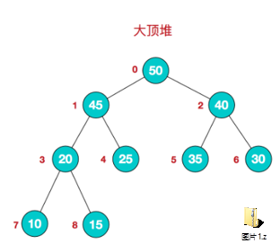
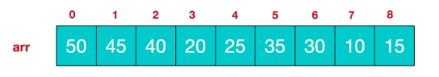
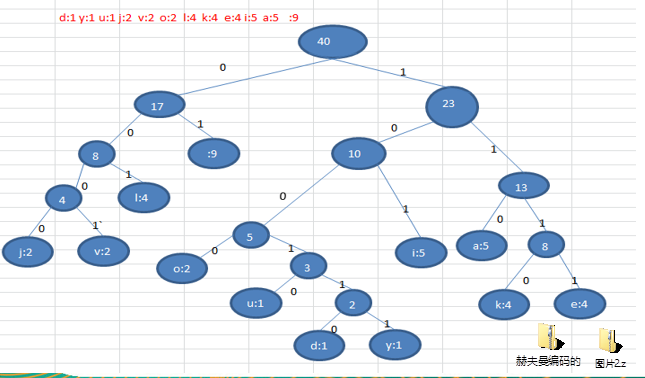

# 树结构应用

## 堆排序

**堆排序基本介绍**

1)堆排序是利用**堆**这种数据结构而设计的一种排序算法，堆排序是一种**选择排序，**它的最坏，最好，平均时间复杂度均为O(nlogn)，它也是不稳定排序。

2)堆是具有以下性质的完全二叉树：每个结点的值都大于或等于其左右孩子结点的值，称为大顶堆, 注意 : 没有要求结点的左孩子的值和右孩子的值的大小关系。

3)每个结点的值都小于或等于其左右孩子结点的值，称为小顶堆

4)大顶堆举例说明



我们对堆中的结点按层进行编号，映射到数组中就是下面这个样子: 



大顶堆特点：arr[i] >=arr[2\*i+1] &&arr[i] >=arr[2\*i+2] // i 对应第几个节点，i从0开始编号

5)小顶堆：arr[i] <=arr[2\*i+1] && arr[i] <=arr[2\*i+2] //i对应第几个节点，i从0开始编号

6)一般**升序采用大顶堆**，**降序采用小顶堆** 

**堆排序基本思想**

堆排序的基本思想是：

1)将待排序序列构造成一个大顶堆

2)此时，整个序列的最大值就是堆顶的根节点。

3)将其与末尾元素进行交换，此时末尾就为最大值。

4)然后将剩余n-1个元素重新构造成一个堆，这样会得到n个元素的次小值。如此反复执行，便能得到一个有序序列了。

可以看到在构建大顶堆的过程中，元素的个数逐渐减少，最后就得到一个有序序列了.

## 赫夫曼树

### 基本介绍

1. 给定n个权值作为n个[叶子结点](https://baike.baidu.com/item/叶子结点/3620239)，构造一棵二叉树，若该树的带权路径长度(wpl)达到最小，称这样的二叉树为**最优二叉树**，也称为**哈夫曼树****(Huffman Tree****)**, 还有的书翻译为**霍夫曼****树**。

2. 赫夫曼树是带权路径长度最短的树，权值较大的结点离根较近。

### 赫夫曼树几个重要概念和举例说明

1. 路径和路径长度：在一棵树中，从一个结点往下可以达到的孩子或孙子结点之间的通路，称为路径。通路中分支的数目称为路径长度。若规定根结点的层数为1，则从根结点到第L层结点的路径长度为L-1

2. 结点的权及带权路径长度：若将树中结点赋给一个有着某种含义的数值，则这个数值称为该结点的权。结点的带权路径长度为：从根结点到该结点之间的路径长度与该结点的权的乘积
3. 树的带权路径长度：树的带权路径长度规定为所有叶子结点的带权路径长度之和，记为WPL(weighted path length) ,权值越大的结点离根结点越近的二叉树才是最优二叉树。
4. WPL最小的就是赫夫曼树

### 赫夫曼树创建思路图解

构成赫夫曼树的步骤：

1. 从小到大进行排序, 将每一个数据，每个数据都是一个节点 ， 每个节点可以看成是一颗最简单的二叉树

2. 取出根节点权值最小的两颗二叉树

3. 组成一颗新的二叉树, 该新的二叉树的根节点的权值是前面两颗二叉树根节点权值的和 

4. 再将这颗新的二叉树，以根节点的权值大小 再次排序， 不断重复 1-2-3-4 的步骤，直到数列中，所有的数据都被处理，就得到一颗赫夫曼树

```java
package com.zixin.learn.sgg.datastructure.huffmantree;

import java.util.ArrayList;
import java.util.Collections;
import java.util.List;

public class HuffmanTree {

	public static void main(String[] args) {
		int arr[] = { 13, 7, 8, 3, 29, 6, 1 };
		Node root = createHuffmanTree(arr);

		// 测试一把
		preOrder(root); //

	}

	// 编写一个前序遍历的方法
	public static void preOrder(Node root) {
		if (root != null) {
			root.preOrder();
		} else {
			System.out.println("是空树，不能遍历~~");
		}
	}

	// 创建赫夫曼树的方法
	/**
	 * 
	 * @param arr
	 *            需要创建成哈夫曼树的数组
	 * @return 创建好后的赫夫曼树的root结点
	 */
	public static Node createHuffmanTree(int[] arr) {
		// 第一步为了操作方便
		// 1. 遍历 arr 数组
		// 2. 将arr的每个元素构成成一个Node
		// 3. 将Node 放入到ArrayList中
		List<Node> nodes = new ArrayList<Node>();
		for (int value : arr) {
			nodes.add(new Node(value));
		}

		// 我们处理的过程是一个循环的过程

		while (nodes.size() > 1) {

			// 排序 从小到大
			Collections.sort(nodes);

			System.out.println("nodes =" + nodes);

			// 取出根节点权值最小的两颗二叉树
			// (1) 取出权值最小的结点（二叉树）
			Node leftNode = nodes.get(0);
			// (2) 取出权值第二小的结点（二叉树）
			Node rightNode = nodes.get(1);

			// (3)构建一颗新的二叉树
			Node parent = new Node(leftNode.value + rightNode.value);
			parent.left = leftNode;
			parent.right = rightNode;

			// (4)从ArrayList删除处理过的二叉树
			nodes.remove(leftNode);
			nodes.remove(rightNode);
			// (5)将parent加入到nodes
			nodes.add(parent);
		}

		// 返回哈夫曼树的root结点
		return nodes.get(0);

	}
}

// 创建结点类
// 为了让Node 对象持续排序Collections集合排序
// 让Node 实现Comparable接口
class Node implements Comparable<Node> {
	int value; // 结点权值
	char c; // 字符
	Node left; // 指向左子结点
	Node right; // 指向右子结点

	// 写一个前序遍历
	public void preOrder() {
		System.out.println(this);
		if (this.left != null) {
			this.left.preOrder();
		}
		if (this.right != null) {
			this.right.preOrder();
		}
	}

	public Node(int value) {
		this.value = value;
	}

	@Override
	public String toString() {
		return "Node [value=" + value + "]";
	}

	@Override
	public int compareTo(Node o) {
		// TODO Auto-generated method stub
		// 表示从小到大排序
		return this.value - o.value;
	}

}

```

### 赫夫曼编码

基本介绍

1. 赫夫曼编码也翻译为 [ 哈](https://baike.baidu.com/item/哈夫曼)[夫曼](https://baike.baidu.com/item/哈夫曼)编码(Huffman Coding)，又称霍夫曼编码，是一种编码方式, 属于一种程序算法

2. 赫夫曼编码是赫哈夫曼树在电讯通信中的经典的应用之一。

3. 赫夫曼编码广泛地用于数据文件压缩。其压缩率通常在20%～90%之间

4. 赫夫曼码是可变[字长](https://baike.baidu.com/item/字长/97660)编码(VLC)的一种。Huffman于1952年提出一种编码方法，称之为最佳编码

**原理剖析**

Ø通信领域中信息的处理方式1-定长编码

•i like like like java do you like a java    // 共40个字符(包括空格) 

•105 32 108 105 107 101 32 108 105 107 101 32 108 105 107 101 32 106 97 118 97 32 100 111 32 121 111 117 32 108 105 107 101 32 97 32 106 97 118 97 //对应Ascii码

•01101001 00100000 01101100 01101001 01101011 01100101 00100000 01101100 01101001 01101011 01100101 00100000 01101100 01101001 01101011 01100101 00100000 01101010 01100001 01110110 01100001 00100000 01100100 01101111 00100000 01111001 01101111 01110101 00100000 01101100 01101001 01101011 01100101 00100000 01100001 00100000 01101010 01100001 01110110 01100001 //对应的二进制

•按照二进制来传递信息，总的长度是 359  (包括空格)

•在线转码 工具 ：[https://www.mokuge.com/tool/asciito16](https://www.mokuge.com/tool/asciito16/)[/](https://www.mokuge.com/tool/asciito16/)

Ø通信领域中信息的处理方式2-变长编码

•i like like like java do you like a java    // 共40个字符(包括空格)

•d:1 y:1 u:1 j:2 v:2 o:2 l:4 k:4 e:4 i:5 a:5  :9 // 各个字符对应的个数

•0= , 1=a, 10=i, 11=e, 100=k, 101=l, 110=o, 111=v, 1000=j, 1001=u, 1010=y, 1011=d
 说明：按照各个字符出现的次数进行编码，原则是出现次数越多的，则编码越小，比如 空格出现了9 次， 编码为0 ,其它依次类推.

•按照上面给各个字符规定的编码，则我们在传输 "i like like like java do you like a java" 数据时，编码就是 
 10010110100... 

•字符的编码都不能是其他字符编码的前缀，符合此要求的编码叫做前缀编码， 即不能匹配到重复的编码(这个在**赫夫曼编码**中，我们还要进行举例说明, 不捉急)

Ø通信领域中信息的处理方式3-赫夫曼编码

•i like like like java do you like a java    // 共40个字符(包括空格)

•d:1 y:1 u:1 j:2 v:2 o:2 l:4 k:4 e:4 i:5 a:5  :9 // 各个字符对应的个数

•按照上面字符出现的次数构建一颗赫夫曼树, 次数作为权值.



//根据赫夫曼树，给各个字符

//规定编码 ， 向左的路径为0

//向右的路径为1 ， 编码如下:

o: 1000  u: 10010 d: 100110 y: 100111 i: 101

a : 110   k: 1110  e: 1111    j: 0000    v: 0001

l: 001     : 01

按照上面的赫夫曼编码，我们的"i like like like java do you like a java"  字符串对应的编码为 (注意这里我们使用的无损压缩)

1010100110111101111010011011110111101001101111011110100001100001110011001111000011001111000100100100110111101111011100100001100001110

长度为 ： 133 

说明:

1)原来长度是 359 , 压缩了 (359-133) / 359 = 62.9%

2)此编码满足前缀编码, 即字符的编码都不能是其他字符编码的前缀。不会造成匹配的多义性

> 注意, 这个赫夫曼树根据排序方法不同，也可能不太一样，**这样对应的赫夫曼编码也不完全一样**，但是wpl 是一样的，都是最小的, 

#### 最佳实践-数据压缩(创建赫夫曼树)

将给出的一段文本，比如 "i like like like java do you like a java" ， 根据前面的讲的赫夫曼编码原理，对其进行数据压缩处理 ，形式如 "1010100110111101111010011011110111101001101111011110100001100001110011001111000011001111000100100100110111101111011100100001100001110"

步骤1：根据赫夫曼编码压缩数据的原理，需要创建 "i like like like java do you like a java" 对应的赫夫曼树.

**思路**：前面已经分析过了，而且我们已然讲过了构建赫夫曼树的具体实现。

我们已经生成了 赫夫曼树, 下面我们继续完成任务

1)生成赫夫曼树对应的赫夫曼编码 , 如下表:
 =01 a=100 d=11000 u=11001 e=1110 v=11011 i=101 y=11010 j=0010 k=1111 l=000 o=0011

2)使用赫夫曼编码来生成赫夫曼编码数据 ,即按照上面的赫夫曼编码，将"i like like like java do you like a java"  字符串生成对应的编码数据, 形式如下.
 1010100010111111110010001011111111001000101111111100100101001101110001110000011011101000111100101000101111111100110001001010011011100

**思路**：前面已经分析过了，而且我们讲过了生成赫夫曼编码的具体实现。